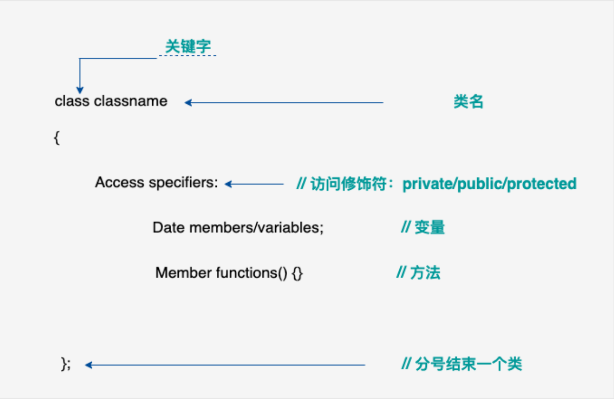
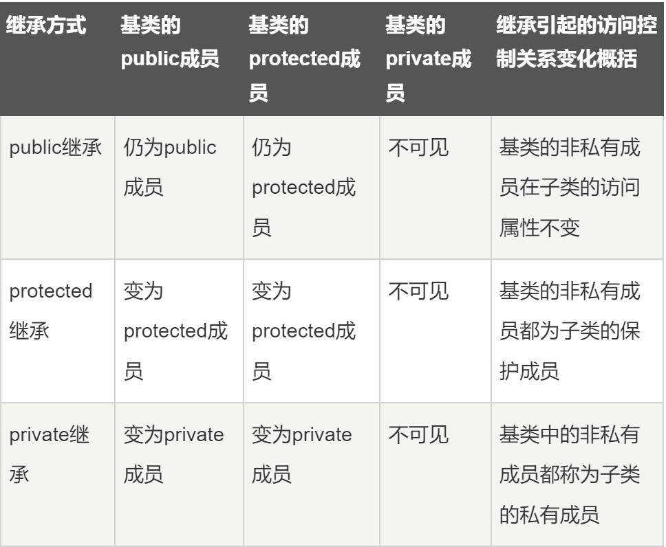
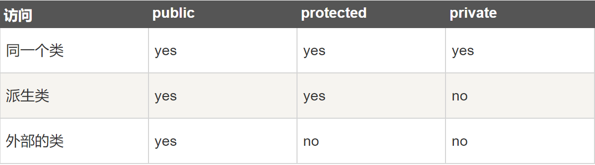
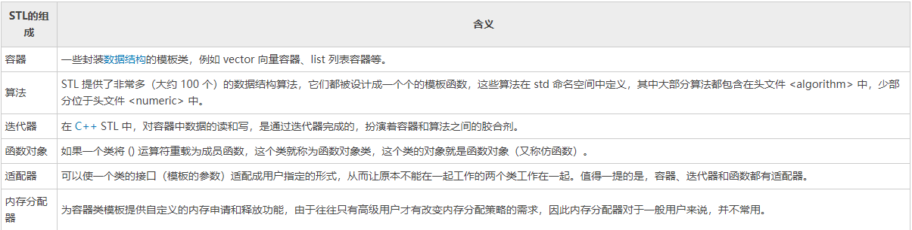
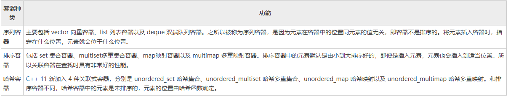
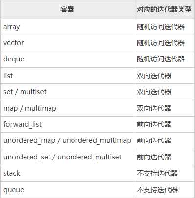
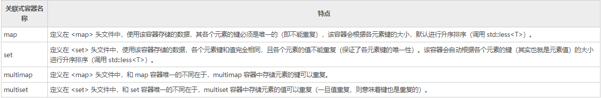
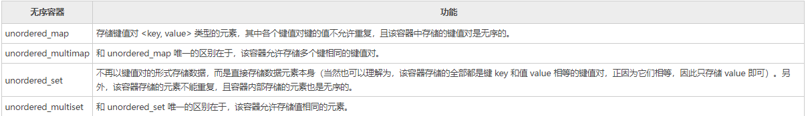
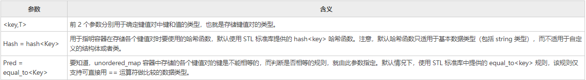
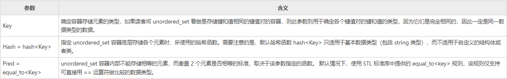

**学习 C++，关键是要理解概念，而不应过于深究语言的技术细节。
学习程序设计语言的目的是为了成为一个更好的程序员，也就是说，是为了能更有效率地设计和实现新系统，以及维护旧系统。**

<!--more-->

# 进入C++

## C++简介

C++ 是一种静态类型的、编译式的、通用的、大小写敏感的、不规则的编程语言，支持过程化编程、面向对象编程和泛型编程。
注意：使用静态类型的编程语言是在编译时执行类型检查，而不是在运行时执行类型检查。

C++ 完全支持面向对象的程序设计，包括面向对象开发的四大特性：
- 封装
- 抽象
- 继承
- 多态

标准的 C++ 由三个重要部分组成：
- 核心语言，提供了所有构件块，包括变量、数据类型和常量，等等。
- C++ 标准库，提供了大量的函数，用于操作文件、字符串等。
- 标准模板库（STL），提供了大量的方法，用于操作数据结构等。

ANSI 标准是为了确保 C++ 的便携性 —— 您所编写的代码在 Mac、UNIX、Windows、Alpha 计算机上都能通过编译。
由于 ANSI 标准已稳定使用了很长的时间，所有主要的 C++ 编译器的制造商都支持 ANSI 标准。

基本上每个应用程序领域的程序员都有使用 C++。
C++ 通常用于编写**设备驱动程序**和其他**要求实时性地直接操作硬件**的软件。
任何一个使用苹果电脑或 Windows PC 机的用户都在间接地使用 C++，因为这些系统的**主要用户接口**是使用 C++ 编写的。

这里安装 GNU 的 C/C++ 编译器，也即GCC（The GNU Compiler Collection）。
要知道，GCC 官网提供的 GCC 编译器是无法直接安装到 Windows 平台上的，如果我们想在 Windows 平台使用 GCC 编译器，可以安装 GCC 的移植版本。

目前适用于 Windows 平台、受欢迎的 GCC 移植版主要有 2 种，分别为 MinGW 和 Cygwin。其中，MinGW 侧重于服务 Windows 用户可以使用 GCC 编译环境，直接生成可运行 Windows 平台上的可执行程序，相比后者体积更小，使用更方便；而 Cygwin 则可以提供一个完整的 Linux 环境，借助它不仅可以在 Windows 平台上使用 GCC 编译器，理论上可以运行 Linux 平台上所有的程序。

MinGw 全称 Minimalist GNU for Windows，应用于 Windows 平台，可以为我们提供一个功能有限的 Linux 系统环境以使用一些 GNU 工具，比如 GCC 编译器、gawk、bison 等等。

## C++ 基本的输入输出

C++ 的 **I/O** 发生在流中，**流是字节序列**。如果字节流是从设备（如键盘、磁盘驱动器、网络连接等）流向内存，这叫做输入操作。如果字节流是从内存流向设备（如显示屏、打印机、磁盘驱动器、网络连接等），这叫做输出操作。

下列的头文件在 C++ 编程中很重要:
- <iostream>: 该文件定义了 cin、cout、cerr 和 clog 对象，分别对应于标准输入流、标准输出流、非缓冲标准错误流和缓冲标准错误流。
- <iomanip>: 该文件通过所谓的参数化的流操纵器（比如 setw 和 setprecision），来声明对执行标准化 I/O 有用的服务。
- <fstream>: 该文件为用户控制的文件处理声明服务。

### 标准输出流（cout）
**预定义的对象** cout 是 iostream **类**的一个**实例**。cout 对象"连接"到标准输出设备，通常是显示屏。cout 是与**流插入运算符 <<** 结合使用的。

C++ **编译器**根据要输出变量的数据类型，选择合适的流插入运算符来显示值。<< 运算符**被重载**来输出内置类型（整型、浮点型、double 型、字符串和指针）的数据项。
流插入运算符 << 在一个语句中可以多次使用，如`cout << "Value of str is : " << str << endl;`，endl 用于在行末添加一个换行符。

### 标准输入流（cin）
预定义的对象 cin 是 iostream 类的一个实例。cin 对象附属到标准输入设备，通常是键盘。cin 是与**流提取运算符 >>** 结合使用的。

C++ 编译器根据要输入值的数据类型，选择合适的流提取运算符来提取值，并把它存储在给定的变量中。

流提取运算符 >> 在一个语句中可以多次使用，如果要求输入多个数据，可以使用语句：`cin >> name >> age;`

### 标准错误流（cerr）
预定义的对象 cerr 是 iostream 类的一个实例。cerr 对象附属到标准输出设备，通常也是显示屏，但是 cerr 对象是非缓冲的，且每个流**插入到 cerr** 都会立即输出。

cerr 也是与流插入运算符 << 结合使用的，如：
```c++
#include <iostream>
 
using namespace std;
 
int main( )
{
   char str[] = "Unable to read....";
 
   cerr << "Error message : " << str << endl;
}
```

### 标准日志流（clog）
预定义的对象 clog 是 iostream 类的一个实例。clog 对象附属到标准输出设备，通常也是显示屏，但是 clog 对象是缓冲的。这意味着每个流插入到 clog 都会先存储在缓冲区，直到**缓冲填满或者缓冲区刷新时**才会输出。

clog 也是与流插入运算符 << 结合使用的，如下所示：
```c++
#include <iostream>
 
using namespace std;
 
int main( )
{
   char str[] = "Unable to read....";
 
   clog << "Error message : " << str << endl;
}
```

通过这些小实例，我们无法区分 cout、cerr 和 clog 的差异，但在编写和执行大型程序时，它们之间的差异就变得非常明显。所以良好的编程实践告诉我们，使用 cerr 流来显示错误消息，而其他的日志消息则使用 clog 流来输出。

## 结构体
为了定义结构，您必须使用 struct 语句。struct 语句定义了一个包含多个成员的新的数据类型，struct 语句的格式如下：

```c++
struct type_name {
member_type1 member_name1;
member_type2 member_name2;
member_type3 member_name3;
.
.
} object_names;
```

type_name 是结构体类型的名称，member_type1 member_name1 是标准的变量定义，在结构定义的末尾，最后一个分号之前，您可以指定一个或多个结构变量（object_names）。

访问结构成员可以使用成员访问运算符（.），如`object_names.member_name1`。
对于指向结构的指针，其成员访问方式有变化，可以使用（->）来访问结构体成员。
参考如下：
```c++
struct type_name * object_ptr; //现在，您可以在这里定义的指针变量中存储结构变量的地址，为了查找结构变量的地址，请把 & 运算符放在结构变量的前面
object_ptr = &object_names;
object_ptr -> member_name1 //为了使用指向该结构的指针访问结构的成员，您必须使用 -> 运算符，等效于object_names.member_name1

```

另外，在函数参数中使用结构体，需要这样定义：`void test( struct type_name object_names )`，使用结构体指针也是一样的`void test( struct type_name *object_names )` 。

使用 typedef 关键字为创建的结构类型取一个"别名"。typedef最后面的是别名，define中间的是别名。例如：
```c++
typedef struct Books
{
   char  title[50];
   char  author[50];
   char  subject[100];
   int   book_id;
}alias;
```
现在，您可以直接使用 alias 来定义 struct Books 类型的变量，而不需要使用 struct 关键字。例如：
`alias Book1, Book2 ;`
还可以使用 typedef 关键字来定义非结构类型，如下所示：
```c++
typedef long int *  pint32;
 
pint32 x, y, z; //x, y 和 z 都是指向长整型 long int数据 的指针。
```

# C++高级教程

## C++ 类 & 对象

C++ 在 C 语言的基础上增加了面向对象编程，C++ 支持面向对象程序设计。类是 C++ 的核心特性，通常被称为**用户定义的类型**。
**类用于指定对象的形式**，它包含了**数据表示法和用于处理数据的方法**。类中的数据和方法称为**类的成员**。函数在一个类中被称为类的成员。

### C++ 类定义
定义一个类，本质上是**定义一个数据类型的蓝图**。这实际上并没有定义任何数据，但它定义了**类的名称意味着什么**，也就是说，它定义了**类的对象**包括了什么，以及**可以在这个对象上执行哪些操作**。



类定义是以关键字 class 开头，后跟类的名称。类的主体是包含在一对花括号中。类定义后必须跟着一个分号或一个声明列表。例如，我们使用关键字 class 定义 Box 数据类型，如下所示：

```c++
class Box
{
   public://关键字 public 确定了类成员的访问属性。在类对象作用域内，公共成员在类的外部是可访问的。
      double length;   // 盒子的长度
      double breadth;  // 盒子的宽度
      double height;   // 盒子的高度
};
```

### 定义 C++ 对象

**类提供了对象的蓝图**，所以基本上，对象是根据类来创建的。声明类的对象，就像声明基本类型的变量一样。如：
```c++
Box Box1;          // 声明 Box1，类型为 Box
Box Box2;          // 声明 Box2，类型为 Box
//对象 Box1 和 Box2 都有它们各自的数据成员。
```

### 访问数据成员 

**类的对象**的**公共（public）数据成员**可以使用**直接成员访问运算符（.）** 来访问。
需要注意的是，**私有的成员和受保护的成员**不能使用直接成员访问运算符 (.) 来直接访问。
实例如下：
```c++
#include <iostream>
 
using namespace std;
 
class Box
{
   public:
      double length;   // 长度
      double breadth;  // 宽度
      double height;   // 高度
      // 成员函数声明
      double get(void);
      void set( double len, double bre, double hei );
};
// 成员函数定义
double Box::get(void)
{
    return length * breadth * height;
}
 
void Box::set( double len, double bre, double hei)
{
    length = len;
    breadth = bre;
    height = hei;
}

int main( )
{
   Box Box1;        // 声明 Box1，类型为 Box
   Box Box2;        // 声明 Box2，类型为 Box
   Box Box3;        // 声明 Box3，类型为 Box
   double volume = 0.0;     // 用于存储体积
 
   // box 1 详述
   Box1.height = 5.0; 
   Box1.length = 6.0; 
   Box1.breadth = 7.0;
 
   // box 2 详述
   Box2.height = 10.0;
   Box2.length = 12.0;
   Box2.breadth = 13.0;
 
   // box 1 的体积
   volume = Box1.height * Box1.length * Box1.breadth;
   cout << "Box1 的体积：" << volume <<endl;
 
   // box 2 的体积
   volume = Box2.height * Box2.length * Box2.breadth;
   cout << "Box2 的体积：" << volume <<endl;
 
 
   // box 3 详述
   Box3.set(16.0, 8.0, 12.0); 
   volume = Box3.get(); 
   cout << "Box3 的体积：" << volume <<endl;
   return 0;
}
```

### 类成员函数

上面例子中的set()和get()都是类成员函数，类的成员函数是指那些把定义和原型写在类定义内部的函数，就像类定义中的其他变量一样。类成员函数是类的一个成员，它可以**操作类的任意对象**，可以**访问对象中的所有成员**。
成员函数可以**定义**在类定义内部，或者单独使用**范围解析运算符**::来定义。
```c++
class Box
{
   public:
      double length;      // 长度
      double breadth;     // 宽度
      double height;      // 高度
   
      double getVolume(void)
      {
         return length * breadth * height;
      }
};
```
```c++
double Box::getVolume(void)
{
   return length * breadth * height;
}
```
两种成员函数定义方法等价。需要强调一点，**在 :: 运算符之前必须使用类名**。调用成员函数是**在对象上**使用点运算符（.），这样它就能**操作与该对象相关的数据**。

---

### C++ 类构造函数 & 析构函数

**类的构造函数**
类的构造函数是类的一种特殊的成员函数，它会在**每次创建类的新对象**时执行。
**构造函数的名称与类的名称是完全相同的**，并且不会返回任何类型，也不会返回 void。构造函数可用于为某些成员变量设置初始值。
```c++
#include <iostream>
 
using namespace std;
 
class Line
{
   public:
      void setLength( double len );
      double getLength( void );
      Line();  // 这是构造函数
 
   private:
      double length;
};
 
// 成员函数定义，包括构造函数
Line::Line(void)
{
    cout << "Object is being created" << endl;
}
 
void Line::setLength( double len )
{
    length = len;
}
 
double Line::getLength( void )
{
    return length;
}
// 程序的主函数
int main( )
{
   Line line;
 
   // 设置长度
   line.setLength(6.0); 
   cout << "Length of line : " << line.getLength() <<endl;
 
   return 0;
}
```

默认的构造函数没有任何参数，但如果需要，构造函数也可以带有参数。这样在**创建对象时就会给对象赋初始值**，这样便可以创造出带初始值的对象。

```c++
#include <iostream>
 
using namespace std;
 
class Line
{
   public:
      void setLength( double len );
      double getLength( void );
      Line(double len);  // 这是构造函数
 
   private:
      double length;
};
 
// 成员函数定义，包括构造函数
Line::Line( double len)
{
    cout << "Object is being created, length = " << len << endl;
    length = len;
}
 
void Line::setLength( double len )
{
    length = len;
}
 
double Line::getLength( void )
{
    return length;
}
// 程序的主函数
int main( )
{
   Line line(10.0);
 
   // 获取默认设置的长度
   cout << "Length of line : " << line.getLength() <<endl;
   // 再次设置长度
   line.setLength(6.0); 
   cout << "Length of line : " << line.getLength() <<endl;
 
   return 0;
}
```

**类的析构函数**

类的析构函数是类的一种特殊的成员函数，它会在每次删除所创建的对象时执行。

析构函数的名称与类的名称是完全相同的，只是在前面加了个波浪号（~）作为前缀，它不会返回任何值，也不能带有任何参数。析构函数有助于在跳出程序（比如关闭文件、释放内存等）前释放资源。

--- 

### 类访问修饰符

**数据封装是面向对象编程的一个重要特点**，它防止函数直接访问类类型的内部成员。类成员的访问限制是通过在类主体内部对各个区域标记 public、private、protected 来指定的。**关键字 public、private、protected 称为访问修饰符**。
一个类可以有多个 public、protected 或 private 标记区域。每个标记区域在下一个标记区域开始之前或者在遇到类主体结束右括号之前都是有效的。成员和类的**默认访问修饰符是 private**。
```c++
class Base {
 
   public:
 
  // 公有成员
 
   protected:
 
  // 受保护成员
 
   private:
 
  // 私有成员
 
};
```

**公有（public）成员**：公有成员在**程序中类的外部是可访问的**。您可以**不使用任何成员函数来设置和获取公有变量的值**，如下所示：
```c++
#include <iostream>
 
using namespace std;
 
class Line
{
   public:
      double length;
      void setLength( double len );
      double getLength( void );
};
 
// 成员函数定义
double Line::getLength(void)
{
    return length ;
}
 
void Line::setLength( double len )
{
    length = len;
}
 
// 程序的主函数
int main( )
{
   Line line;
 
   // 设置长度
   line.setLength(6.0); 
   cout << "Length of line : " << line.getLength() <<endl;
 
   // 不使用成员函数设置长度
   line.length = 10.0; // OK: 因为 length 是公有的
   cout << "Length of line : " << line.length <<endl;
   return 0;
}
```

**私有（private）成员**: 私有成员**变量或函数在类的外部是不可访问的，甚至是不可查看的**。只有**类内部和友元函数可以访问**私有成员。
默认情况下，类的所有成员都是私有的。例如在下面的类中，width 是一个私有成员，这意味着，如果您没有使用任何访问修饰符，类的成员将被假定为私有成员：
```c++
class Box
{
   double width;
   public:
      double length;
      void setWidth( double wid );
      double getWidth( void );
};
```

实际操作中，我们一般会在**私有区域定义数据，在公有区域定义相关的函数**，以便在类的外部也可以调用这些函数，如下所示：
```c++
#include <iostream>
 
using namespace std;
 
class Box
{
   public:
      double length;
      void setWidth( double wid );
      double getWidth( void );
 
   private:
      double width;
};
 
// 成员函数定义
double Box::getWidth(void)
{
    return width ;
}
 
void Box::setWidth( double wid )
{
    width = wid;
}
 
// 程序的主函数
int main( )
{
   Box box;
 
   // 不使用成员函数设置长度
   box.length = 10.0; // OK: 因为 length 是公有的
   cout << "Length of box : " << box.length <<endl;
 
   // 不使用成员函数设置宽度
   // box.width = 10.0; // Error: 因为 width 是私有的
   box.setWidth(10.0);  // 使用成员函数设置宽度
   cout << "Width of box : " << box.getWidth() <<endl;
 
   return 0;
}
```

**protected（受保护）成员**:
protected（受保护）成员变量或函数与私有成员十分相似，但有一点不同，protected（受保护）成员在**派生类（即子类）中是可访问**的。

下面的实例中，我们从父类 Box 派生了一个子类 smallBox。在这里 width 成员可被**派生类(即子类)smallBox 的任何成员函数**访问。
```c++
#include <iostream>
using namespace std;
 
class Box
{
   protected:
      double width;
};
 
class SmallBox:Box // SmallBox 是派生类
{
   public:
      void setSmallWidth( double wid );
      double getSmallWidth( void );
};
 
// 子类的成员函数
double SmallBox::getSmallWidth(void)
{
    return width ;
}
 
void SmallBox::setSmallWidth( double wid )
{
    width = wid;
}
 
// 程序的主函数
int main( )
{
   SmallBox box;
 
   // 使用成员函数设置宽度
   box.setSmallWidth(5.0);
   cout << "Width of box : "<< box.getSmallWidth() << endl;
 
   return 0;
}
```

### 继承中的特点

有public, protected, private三种继承方式，它们相应地改变了基类(父类)成员的访问属性。
- **public 继承**：基类 public 成员，protected 成员，private 成员的访问属性在派生类中分别变成：public, protected, private
- **protected 继承**：基类 public 成员，protected 成员，private 成员的访问属性在派生类中分别变成：protected, protected, private
- **private 继承**：基类 public 成员，protected 成员，private 成员的访问属性在派生类中分别变成：private, private, private

但无论哪种继承方式，上面两点都没有改变：
- private 成员只能被本类成员（类内）和友元函数访问，不能被派生类访问；
- protected 成员可以被派生类访问。

**注意：C中如果函数未指定返回值类型，则默认为int。C++中如果一个函数没有返回值，返回值类型必须指定为void。但要区别于类的构造函数**

**public继承：**

```c++
#include<iostream>
#include<assert.h>
using namespace std;
 
class A{
public:
  int a;
  A(){
    a1 = 1;
    a2 = 2;
    a3 = 3;
    a = 4;
  }
  void fun(){
    cout << a << endl;    //正确
    cout << a1 << endl;   //正确
    cout << a2 << endl;   //正确
    cout << a3 << endl;   //正确
  }
public:
  int a1;
protected:
  int a2;
private:
  int a3;
};
class B : public A{
public:
  int a;
  B(int i){
    A();
    a = i;
  }
  void fun(){
    cout << a << endl;       //正确，public成员
    cout << a1 << endl;       //正确，基类的public成员，在派生类中仍是public成员。
    cout << a2 << endl;       //正确，基类的protected成员，在派生类中仍是protected可以被派生类访问。
    cout << a3 << endl;       //错误，基类的private成员不能被派生类访问。
  }
};
int main(){
  B b(10);
  cout << b.a << endl;
  cout << b.a1 << endl;   //正确
  cout << b.a2 << endl;   //错误，类外不能访问protected成员
  cout << b.a3 << endl;   //错误，类外不能访问private成员
  system("pause");
  return 0;
}
```

**protected继承：**
```c++
#include<iostream>
#include<assert.h>
using namespace std;
class A{
public:
  int a;
  A(){
    a1 = 1;
    a2 = 2;
    a3 = 3;
    a = 4;
  }
  void fun(){
    cout << a << endl;    //正确
    cout << a1 << endl;   //正确
    cout << a2 << endl;   //正确
    cout << a3 << endl;   //正确
  }
public:
  int a1;
protected:
  int a2;
private:
  int a3;
};
class B : protected A{
public:
  int a;
  B(int i){
    A();
    a = i;
  }
  void fun(){
    cout << a << endl;       //正确，public成员。
    cout << a1 << endl;       //正确，基类的public成员，在派生类中变成了protected，可以被派生类访问。
    cout << a2 << endl;       //正确，基类的protected成员，在派生类中还是protected，可以被派生类访问。
    cout << a3 << endl;       //错误，基类的private成员不能被派生类访问。
  }
};
int main(){
  B b(10);
  cout << b.a << endl;       //正确。public成员
  cout << b.a1 << endl;      //错误，protected成员不能在类外访问。
  cout << b.a2 << endl;      //错误，protected成员不能在类外访问。
  cout << b.a3 << endl;      //错误，private成员不能在类外访问。
  system("pause");
  return 0;
}
```

**private继承：**
```c++
#include<iostream>
#include<assert.h>
using namespace std;
class A{
public:
  int a;
  A(){
    a1 = 1;
    a2 = 2;
    a3 = 3;
    a = 4;
  }
  void fun(){
    cout << a << endl;    //正确
    cout << a1 << endl;   //正确
    cout << a2 << endl;   //正确
    cout << a3 << endl;   //正确
  }
public:
  int a1;
protected:
  int a2;
private:
  int a3;
};
class B : private A{
public:
  int a;
  B(int i){
    A();
    a = i;
  }
  void fun(){
    cout << a << endl;       //正确，public成员。
    cout << a1 << endl;       //正确，基类public成员,在派生类中变成了private,可以被派生类访问。
    cout << a2 << endl;       //正确，基类的protected成员，在派生类中变成了private,可以被派生类访问。
    cout << a3 << endl;       //错误，基类的private成员不能被派生类访问。
  }
};
int main(){
  B b(10);
  cout << b.a << endl;       //正确。public成员
  cout << b.a1 << endl;      //错误，private成员不能在类外访问。
  cout << b.a2 << endl;      //错误, private成员不能在类外访问。
  cout << b.a3 << endl;      //错误，private成员不能在类外访问。
  system("pause");
  return 0;
}
```

注意分辨其中区别，如果是public继承，三种成员在派生类中还是不变的，但是**派生类不能访问基类的private成员**；如果是protected继承，基类的public和private变为在派生类中都变为protected成员，因此在类中可以访问，但是类外不行，基类的private成员依然不能访问，无论是类中还是类外；如果是private继承，基类的public和protected成员变为派生类中的private成员，类中可以访问，类外不行，且基类的private成员仍然不能在类中或类外访问。

如果继承的时候不显式声明是 private，protected，public 继承，则**class 默认是 private 继承**，**struct默认是public继承**。另外，类中不写是什么类型的成员，默认是private。

总结一下三种继承方式：



## 关于C++中的struct和class
C++ 中的 struct 对 C 中的 struct 进行了扩充，它已经不再只是一个包含不同数据类型的数据结构了，它已经获取了太多的功能。

struct 能包含成员函数吗？ 能！

struct 能继承吗？ 能！！

struct 能实现多态吗？ 能！！！

既然这些它都能实现，那它和 class 还能有什么区别？

最本质的一个区别就是默认的访问控制，体现在两个方面：

1）默认的继承访问权限。struct是public的，class是private的。

你可以写如下的代码：
```c++
struct A
{
    char a;
};
struct B : A
{
    char b;
};
```
这个时候 B 是 public 继承 A 的。

如果都将上面的 struct 改成 class，那么 B 是 private 继承 A 的。这就是默认的继承访问权限。

所以我们在平时写类继承的时候，通常会这样写：
```c++
struct B : public A
```
就是为了指明是 public 继承，而不是用默认的 private 继承。

当然，到底默认是 public 继承还是 private 继承，取决于子类而不是基类。

我的意思是，struct 可以继承 class，同样 class 也可以继承 struct，那么默认的继承访问权限是看子类到底是用的 struct 还是 class。如下：
```c++
struct A{}; 
class B : A{}; //private继承
struct C : B{}; //public继承
```
2）struct 作为数据结构的实现体，它默认的数据访问控制是 public 的，而 class 作为对象的实现体，它默认的成员变量访问控制是 private 的。

注意我上面的用词，我依旧强调 struct 是一种数据结构的实现体，虽然它是可以像 class 一样的用。我依旧将 struct 里的变量叫数据，class 内的变量叫成员，虽然它们并无区别。

其实，到底是用 struct 还是 class，完全看个人的喜好，你可以将你程序里所有的 class 全部替换成 struct，它依旧可以很正常的运行。但我给出的最好建议，还是：当你觉得你要做的更像是一种数据结构的话，那么用 struct，如果你要做的更像是一种对象的话，那么用 class。

当然，我在这里还要强调一点的就是，对于访问控制，应该在程序里明确的指出，而不是依靠默认，这是一个良好的习惯，也让你的代码更具可读性。

说到这里，很多了解的人或许都认为这个话题可以结束了，因为他们知道 struct 和 class 的“唯一”区别就是访问控制。很多文献上也确实只提到这一个区别。

但我上面却没有用“唯一”，而是说的“最本质”，那是因为，它们确实还有另一个区别，虽然那个区别我们平时可能很少涉及。那就是：“class” 这个关键字还用于定义模板参数，就像 “typename”。但关键字 “struct” 不用于定义模板参数。这一点在 Stanley B.Lippman 写的 Inside the C++ Object Model 有过说明。

问题讨论到这里，基本上应该可以结束了。但有人曾说过，他还发现过其他的“区别”，那么，让我们来看看，这到底是不是又一个区别。还是上面所说的，C++ 中的 struct 是对 C 中的 struct 的扩充，既然是扩充，那么它就要兼容过去 C 中 struct 应有的所有特性。例如你可以这样写：
```c++
struct A //定义一个struct
{
    char c1;
    int n2;
    double db3;
};
A a={'p',7,3.1415926}; //定义时直接赋值
```
也就是说 struct 可以在定义的时候用 {} 赋初值。那么问题来了，class 行不行呢？将上面的 struct 改成 class，试试看。报错！噢~于是那人跳出来说，他又找到了一个区别。我们仔细看看，这真的又是一个区别吗？

你试着向上面的 struct 中加入一个构造函数（或虚函数），你会发现什么？

对，struct 也不能用 {} 赋初值了。

的确，以 {} 的方式来赋初值，只是用一个初始化列表来对数据进行按顺序的初始化，如上面如果写成 A a={'p',7}; 则 c1,n2 被初始化，而 db3 没有。这样简单的 copy 操作，只能发生在简单的数据结构上，而不应该放在对象上。加入一个构造函数或是一个虚函数会使 struct 更体现出一种对象的特性，而使此{}操作不再有效。

事实上，是因为加入这样的函数，使得类的内部结构发生了变化。而加入一个普通的成员函数呢？你会发现{}依旧可用。其实你可以将普通的函数理解成对数据结构的一种算法，这并不打破它数据结构的特性。

那么，看到这里，我们发现即使是 struct 想用 {} 来赋初值，它也必须满足很多的约束条件，这些条件实际上就是让 struct 更体现出一种数据机构而不是类的特性。

那为什么我们在上面仅仅将 struct 改成 class，{} 就不能用了呢？

其实问题恰巧是我们之前所讲的——访问控制！你看看，我们忘记了什么？对，将 struct 改成 class 的时候，访问控制由 public 变为 private 了，那当然就不能用 {} 来赋初值了。加上一个 public，你会发现，class 也是能用 {} 的，和 struct 毫无区别！！！

做个总结，从上面的区别，我们可以看出，**struct 更适合看成是一个数据结构的实现体，class 更适合看成是一个对象的实现体**。

## 继承

面向对象程序设计中最重要的一个概念是继承。继承允许我们依据另一个类来定义一个类，这使得创建和维护一个应用程序变得更容易。这样做，也达到了重用代码功能和提高执行效率的效果。
当创建一个类时，您不需要重新编写新的数据成员和成员函数，只需指定新建的类继承了一个已有的类的成员即可。这个已有的类称为**基类**，新建的类称为**派生类**。

### 访问控制和继承

**派生类可以访问基类中所有的非私有成员**。因此基类成员如果不想被派生类的成员函数访问，则应在基类中声明为 private。

我们可以根据访问权限总结出不同的访问类型，如下所示：


一个派生类**继承了所有的基类方法**，但下列情况除外：
- 基类的构造函数、析构函数和拷贝构造函数
- 基类的重载运算符
- 基类的友元函数

### 继承类型
当一个类派生自基类，该基类可以被继承为 public、protected 或 private 几种类型。继承类型是通过上面讲解的访问修饰符 access-specifier 来指定的。

我们几乎不使用 protected 或 private 继承，**通常使用** public 继承。当使用不同类型的继承时，遵循以下几个规则：
- 公有继承（public）：当一个类派生自公有基类时，基类的公有成员也是派生类的公有成员，基类的保护成员也是派生类的保护成员，基类的私有成员不能直接被派生类访问，但是可以通过调用基类的公有和保护成员来访问。
- 保护继承（protected）： 当一个类派生自保护基类时，基类的公有和保护成员将成为派生类的保护成员。
- 私有继承（private）：当一个类派生自私有基类时，基类的公有和保护成员将成为派生类的私有成员。

### 多继承
多继承即一个子类可以有多个父类，它继承了多个父类的特性。

C++ 类可以从多个类继承成员，语法如下：
```c++
class <派生类名>:<继承方式1><基类名1>,<继承方式2><基类名2>,…
{
<派生类类体>
};
```

## C++ 重载运算符和重载函数

C++ 允许在**同一作用域中**的某个函数和运算符**指定多个定义**，分别称为函数重载和运算符重载。
重载声明是指一个与**之前已经在该作用域内声明过的函数或方法**具有**相同名称**的声明，但是它们的参数列表和定义（实现）不相同。
当您调用一个**重载函数或重载运算符**时，编译器通过把您所使用的参数类型与定义中的参数类型进行**比较**，决定选用最合适的定义。选择最合适的重载函数或重载运算符的过程，称为**重载决策**。

### 重载函数:

在同一个作用域内，可以声明几个功能类似的同名函数，但是这些同名函数的**形式参数（指参数的个数、类型或者顺序）必须不同**。您不能仅通过返回类型的不同来重载函数。

下面的实例中，同名函数 print() 被用于输出不同的数据类型：

```c++
#include <iostream>
using namespace std;
 
class printData
{
   public:
      void print(int i) {
        cout << "整数为: " << i << endl;
      }
 
      void print(double  f) {
        cout << "浮点数为: " << f << endl;
      }
 
      void print(char c[]) {
        cout << "字符串为: " << c << endl;
      }
};
 
int main(void)
{
   printData pd;
 
   // 输出整数
   pd.print(5);
   // 输出浮点数
   pd.print(500.263);
   // 输出字符串
   char c[] = "Hello C++";
   pd.print(c);
 
   return 0;
}
```

### C++ 中的运算符重载
您可以重定义或重载大部分 C++ 内置的运算符。这样，您就能使用自定义类型的运算符。

**重载的运算符是带有特殊名称的函数**，函数名是由**关键字 operator 和其后要重载的运算符符号构成**的。与其他函数一样，重载运算符有一个返回类型和一个参数列表。

`Box operator+(const Box&);`

声明加法运算符用于把两个 Box 对象相加，返回最终的 Box 对象。大多数的重载运算符可被定义为普通的非成员函数或者被定义为类成员函数。如果我们定义上面的函数为类的非成员函数，那么我们需要为每次操作传递两个参数，如下所示：

`Box operator+(const Box&, const Box&);`


## C++引用

`&`引用是 C++ 的新增内容，在实际开发中会经常使用；C++ 用的引用就如同C语言的指针一样重要，但它比指针更加方便和易用，有时候甚至是不可或缺的。

同指针一样，引用能够减少数据的拷贝，提高数据的传递效率。

[将引用作为函数的返回参数](https://www.runoob.com/cplusplus/returning-values-by-reference.html)


## 多态与虚函数

 面向对象程序设计语言有**封装、继承和多态**三种机制，这三种机制能够有效提高程序的**可读性、可扩充性和可重用性**。

“**多态（polymorphism）**”指的是**同一名字的事物可以完成不同的功能**。多态可以分为**编译时的多态**和**运行时的多态**。前者主要是指函数的重载（包括运算符的重载）、对重载函数的调用，在**编译时就能根据实参确定应该调用哪个函数**，因此叫编译时的多态；而后者则和**继承、虚函数**等概念有关，是本章要讲述的内容。本教程后面提及的多态都是指运行时的多态。


## 模板和泛型程序设计

泛型程序设计（generic programming）是一种**算法在实现时不指定具体要操作的数据的类型**的程序设计方法。所谓“泛型”，指的是算法只要实现一遍，就能适用于多种数据类型。泛型程序设计方法的优势在于能够减少重复代码的编写。

泛型程序设计的概念最早出现于 1983 年的 Ada 语言，其最成功的应用就是 C++ 的标准模板库（STL）。也可以说，泛型程序设计就是大量编写模板、使用模板的程序设计。泛型程序设计在 C++ 中的重要性和带来的好处不亚于面向对象的特性。

在 C++ 中，**模板分为函数模板和类模板两种**。熟练的 C++ 程序员，在编写函数时都会考虑能否**将其写成函数模板**，编写类时都会考虑能否**将其写成类模板**，以便实现重用。

### 函数模板

我们知道，**数据的值可以通过函数参数传递**，在函数定义时数据的值是未知的，只有等到函数调用时接收了实参才能确定其值。这就是值的参数化。

在C++中，**数据的类型也可以通过参数来传递**，在函数定义时可以不指明具体的数据类型，当发生函数调用时，编译器可以根据传入的实参自动推断数据类型。这就是类型的参数化。

**值**（Value）和**类型**（Type）是数据的两个主要特征，它们在C++中都可以被参数化。

所谓函数模板，实际上是建立一个通用函数，它所**用到的数据的类型**（包括返回值类型、形参类型、局部变量类型）可以不具体指定，而是**用一个虚拟的类型来代替**（实际上是用一个**标识符来占位**），等发生**函数调用时**再根据传入的实参来逆推出真正的类型。这个通用函数就称为**函数模板（Function Template）**。

在函数模板中，数据的值和类型都被参数化了，发生函数调用时**编译器会根据传入的实参来推演形参的值和类型**。换个角度说，函数模板除了支持值的参数化，还支持类型的参数化。

一旦定义了函数模板，就可以将**类型参数**用于函数定义和函数声明了。说得直白一点，原来使用 int、float、char 等内置类型的地方，都可以用**类型参数**来代替。

```c++
#include <iostream>
using namespace std;

template<typename T> void Swap(T *a, T *b){
    T temp = *a;
    *a = *b;
    *b = temp;
}

int main(){
    //交换 int 变量的值
    int n1 = 100, n2 = 200;
    Swap(&n1, &n2);
    cout<<n1<<", "<<n2<<endl;
   
    //交换 float 变量的值
    float f1 = 12.5, f2 = 56.93;
    Swap(&f1, &f2);
    cout<<f1<<", "<<f2<<endl;
   
    //交换 char 变量的值
    char c1 = 'A', c2 = 'B';
    Swap(&c1, &c2);
    cout<<c1<<", "<<c2<<endl;
   
    //交换 bool 变量的值
    bool b1 = false, b2 = true;
    Swap(&b1, &b2);
    cout<<b1<<", "<<b2<<endl;

    return 0;
}
```

**template**是定义函数模板的**关键字**，它后面紧跟尖括号<>，尖括号包围的是**类型参数**（也可以说是**虚拟的类型**，或者说是**类型占位符**）。**typename**是另外一个**关键字**，用来声明具体的**类型参数**，这里的类型参数就是T，实际上可以随意指定。从整体上看，**template<typename T>**被称为**模板头**。

模板头中包含的类型参数可以用在函数定义的各个位置，包括返回值、形参列表和函数体；本例我们在形参列表和函数体中使用了类型参数T。

类型参数的命名规则跟其他标识符的命名规则一样，不过使用 T、T1、T2、Type 等已经成为了一种惯例。

```c++
#include <iostream>
using namespace std;
template<typename T> void Swap(T &a, T &b){
    T temp = a;
    a = b;
    b = temp;
}
int main(){
    //交换 int 变量的值
    int n1 = 100, n2 = 200;
    Swap(n1, n2);
    cout<<n1<<", "<<n2<<endl;
   
    //交换 float 变量的值
    float f1 = 12.5, f2 = 56.93;
    Swap(f1, f2);
    cout<<f1<<", "<<f2<<endl;
   
    //交换 char 变量的值
    char c1 = 'A', c2 = 'B';
    Swap(c1, c2);
    cout<<c1<<", "<<c2<<endl;
   
    //交换 bool 变量的值
    bool b1 = false, b2 = true;
    Swap(b1, b2);
    cout<<b1<<", "<<b2<<endl;
    return 0;
}
```

下面我们来总结一下定义模板函数的语法：
> template <typename 类型参数1 , typename 类型参数2 , ...> 返回值类型  函数名(形参列表){
    //在函数体中可以使用类型参数
}

类型参数可以有多个，它们之间以逗号,分隔。类型参数列表以< >包围，形式参数列表以( )包围。

typename关键字也可以使用class关键字替代，它们没有任何区别。


# STL 




## STL 容器

STL标准库中所有的序列式容器，包括 **array、vector、deque、list 和 forward_list**容器。

所谓STL序列式容器，其共同的特点是**不会对存储的元素进行排序**，元素排列的顺序取决于**存储它们的顺序**。

简单的理解容器，它就是一些**模板类的集合**，但和普通模板类不同的是，容器中封装的是组**织数据的方法（也就是数据结构）**。STL 提供有 3 类标准容器，分别是**序列容器、排序容器和哈希容器**，其中后两类容器有时也统称为关联容器。



 C++ 11 标准中不同容器指定使用的迭代器类型。




### STL 序列容器

#### vector<T>

vector\<T> 容器是包含 T 类型元素的序列容器，和 array\<T，N> 容器相似，不同的是 vector\<T> 容器的大小可以自动增长，从而可以包含任意数量的元素；因此类型参数 T 不再需要模板参数 N。只要元素个数超出 vector 当前容量，就会自动分配更多的空间。**只能在容器尾部高效**地删除或添加元素。

vector\<T> 容器可以方便、灵活地代替数组。在**大多数**时候，都可以用 vector\<T> 代替数组存放元素。只要能够意识到，vector\<T> 在**扩展容量，以及在序列内部删除或添加元素时会产生一些开销**；但大多数情况下，代码不会明显变慢。 为了使用 vector\<T> 容器模板，需要在代码中包含头文件 vector。

**vector 容器的成员函数，用成员符号 . 调用**
```c++
begin()	返回指向容器中第一个元素的迭代器。
end()	返回指向容器最后一个元素所在位置后一个位置的迭代器，通常和 begin() 结合使用。
size()	返回实际元素个数。
resize()	改变实际元素的个数。
capacity()	返回当前容量。 // 注意容量和size的区
operator[ ]	重载了 [ ] 运算符，可以向访问数组中元素那样，通过下标即可访问甚至修改 vector 容器中的元素。
push_back()	在序列的尾部添加一个元素。
pop_back()	移出序列尾部的元素。
insert()	在指定的位置插入一个或多个元素。// vec.insert(value.begin(),  data);
emplace()	在指定的位置直接生成一个元素。// 比insert效率高

// 遍历
for (auto iter = value.begin(); iter  < value.end(); iter ++) {
        cout << *iter  << " "; 
    }
// 其实迭代器和指针类似，所以如果迭代的是结构体或键值对，可以使用运算符->来输出值，如下：
for (map<string, string>::iterator it = mymap.begin(); it != mymap.end(); ++it) {
        //输出各个元素中的键和值
        cout << it->first << " => " << it->second << '\n';
    }
```

**vector可以用 ListNode 或 ListNode* 数据类型**


### STL 关联式容器

**关联式容器**，包括 **map、multimap、set 以及 multiset** 这 4 种容器。

和序列式容器不同的是，关联式容器在存储元素时还会为每个元素再配备一个键，整体以键值对的方式存储到容器中。相比前者，关联式容器可以通过键值直接找到对应的元素，而无需遍历整个容器。另外，关联式容器在存储元素时，默认会根据各元素**键的大小**做**升序**排序。

无论是哪种序列式容器，其存储的都是 C++ 基本数据类型（诸如 int、double、float、string 等）或使用结构体自定义类型的元素，

关联式容器则大不一样，此类容器在存储元素值的同时，还会为各元素额外再配备一个值（又称为“键”，**其本质也是一个 C++ 基础数据类型或自定义类型的元素**），它的功能是在使用关联式容器的过程中，如果已知目标元素的键的值，则直接通过该键就可以找到目标元素，而无需再通过遍历整个容器的方式。

也就是说，使用关联式容器存储的元素，都是一个一个的“键值对”（ <key,value> ），这是和序列式容器最大的不同。
除此之外，序列式容器中存储的元素默认都是未经过排序的，而使用关联式容器存储的元素，默认会**根据各元素的键值的大小做升序**排序。

关联式容器所具备的这些特性，归咎于 STL 标准库在实现该类型容器时，底层选用了**红黑树**这种数据结构来组织和存储各个键值对。

C++ STL 标准库提供了 4 种关联式容器，分别为 **map、set、multimap、multiset**：



除此之外，C++ 11 还新增了 4 种哈希容器，即 **unordered_map、unordered_multimap 以及 unordered_set、unordered_multiset**。严格来说，它们也属于关联式容器，但哈希容器底层采用的是哈希表，而不是红黑树。


注意: 基于各个关联式容器存储数据的特点，只有**各个键值对中的键和值全部对应相等**时，才能使用 **set 和 multiset 关联式容器**存储，否则就要选用 map 或者 multimap 关联式容器。


[看到这](https://c.biancheng.net/view/7173.html)


### STL 无序关联式容器

无序关联式容器，又称**哈希容器**。和关联式容器一样，此类容器存储的也是键值对元素；不同之处在于，关联式容器默认情况下会对存储的元素做升序排序，而无序关联式容器不会。

和其它类容器相比，无序关联式容器擅长通过指定键查找对应的值，而遍历容器中存储元素的效率不如关联式容器。

无序容器是 C++ 11 标准才正式引入到 STL 标准库中的，这意味着如果要使用该类容器，则必须选择支持 C++ 11 标准的编译器。

和关联式容器一样，无序容器也使用键值对（pair 类型）的方式存储数据。不过二者有本质上的不同：
- 关联式容器的底层实现采用的树存储结构，更确切的说是红黑树结构；
- 无序容器的底层实现采用的是哈希表的存储结构。

基于底层实现采用了不同的数据结构，因此和关联式容器相比，无序容器具有以下 2 个特点：
- 无序容器内部存储的键值对是无序的，各键值对的存储位置取决于该键值对中的键；
- 和关联式容器相比，无序容器擅长通过指定键查找对应的值（平均时间复杂度为 O(1)）；但对于使用迭代器遍历容器中存储的元素，无序容器的执行效率则不如关联式容器。

和关联式容器一样，无序容器只是一类容器的统称，其包含有 4 个具体容器，分别为 unordered_map、unordered_multimap、unordered_set 、unordered_multiset。



可以看出：C++ 11 标准的 STL 中，在已提供有 4 种关联式容器的基础上，又新增了各自的“unordered”版本（无序版本、哈希版本），提高了查找指定元素的效率。

总的来说，实际场景中如果涉及大量**遍历**容器的操作，建议首选关联式容器；反之，如果更多的操作是通过键获取对应的值，则应首选无序容器。


#### unordered_map

unordered_map 容器在<unordered_map>头文件中，并位于 std 命名空间中。
nordered_map 容器模板的定义如下所示：
```c++
template < class Key,                        //键值对中键的类型
           class T,                          //键值对中值的类型
           class Hash = hash<Key>,           //容器内部存储键值对所用的哈希函数
           class Pred = equal_to<Key>,       //判断各个键值对键相同的规则
           class Alloc = allocator< pair<const Key,T> >  // 指定分配器对象的类型
           > class unordered_map;
```

模板类参数：


默认哈希函数是对键(key)使用的，而且只适用于基本数据类型(包括string)，而不支持自定义的结构体或类。
总的来说，当无序容器中存储键值对的**键**为自定义类型时，默认的哈希函数 hash 以及比较函数 equal_to 将不再适用，只能自己设计适用该类型的哈希函数和比较函数，并显式传递给 Hash 参数和 Pred 参数。

**初始化**：`std::unordered_map< Tkey, Tvalue > umap;`

```c++
begin()	返回指向容器中第一个键值对的正向迭代器。
end() 	返回指向容器中最后一个键值对之后位置的正向迭代器。
cbegin()	和 begin() 功能相同，只不过在其基础上增加了 const 属性，即该方法返回的迭代器不能用于修改容器内存储的键值对。
cend()	和 end() 功能相同，只不过在其基础上，增加了 const 属性，即该方法返回的迭代器不能用于修改容器内存储的键值对。
size()	返回当前容器中存有键值对的个数。
operator[key]	该模板类中重载了 [] 运算符，其功能是可以向访问数组中元素那样，只要给定某个键值对的键 key，就可以获取该键对应的值。注意，如果当前容器中没有以 key 为键的键值对，则其会使用该键向当前容器中插入一个新键值对。
at(key)	返回容器中存储的键 key 对应的值，如果 key 不存在，则会抛出 out_of_range 异常。 
find(key)	查找以 key 为键的键值对，如果找到，则返回一个指向该键值对的正向迭代器；反之，则返回一个指向容器中最后一个键值对之后位置的迭代器（即 end() 方法返回的迭代器）。
count(key)	在容器中查找以 key 键的键值对的个数。
emplace()	向容器中添加新键值对，效率比 insert() 方法高。
insert() 	向容器中添加新键值对。
```

需要注意的是，如果当前容器中并没有存储以 [ ] 运算符内指定的元素作为键的键值对，则此时 [ ] 运算符的功能将转变为：向当前容器中添加以目标元素为键的键值对。举个例子：

```c++
#include <iostream>
#include <string>
#include <unordered_map>
using namespace std;
int main()
{
    //创建空 umap 容器
    unordered_map<string, string> umap;
    //[] 运算符在 = 右侧
    string str = umap["STL"];
    //[] 运算符在 = 左侧
    umap["blog"] = "https://iridescent-zhang.github.io/";
   
    for (auto iter = umap.begin(); iter != umap.end(); ++iter) {
        cout << iter->first << " " << iter->second << endl;
    }
    return 0;
}
运行结果为：
blog https://iridescent-zhang.github.io/
STL

```
可以看到，当使用 [ ] 运算符向 unordered_map 容器中添加键值对时，分为 2 种情况：
- 当 [ ] 运算符位于赋值号（=）右侧时，则新添加键值对的键为 [ ] 运算符内的元素，其值为键值对要求的值类型的默认值（string 类型默认值为空字符串）；
- 当 [ ] 运算符位于赋值号（=）左侧时，则新添加键值对的键为 [ ] 运算符内的元素，其值为赋值号右侧的元素。


unordered_map**修改键值对的值value**直接像数组那样操作就可以了，也可以用迭代器。


#### unordered_set

unordered_set 容器具有以下几个特性：
1. 不再以键值对的形式存储数据，而是直接存储数据的值；
2. 容器内部存储的各个元素值都互不相等，且不能被修改；
3. 不会对内部存储的数据进行排序；

实现 unordered_set 容器的模板类定义在<unordered_set>头文件。
unordered_set 容器的类模板定义如下：
```c++
template < class Key,            //容器中存储元素的类型
           class Hash = hash<Key>,    //确定元素存储位置所用的哈希函数
           class Pred = equal_to<Key>,   //判断各个元素是否相等所用的函数
           class Alloc = allocator<Key>   //指定分配器对象的类型
           > class unordered_set;
```



注意，如果 unordered_set 容器中存储的元素为自定义的数据类型，则默认的哈希函数 hash<key> 以及比较函数 equal_to<key> 将不再适用，只能自己设计适用该类型的哈希函数和比较函数，并显式传递给 Hash 参数和 Pred 参数。

**初始化**：`std::unordered_set< T > uset;`

```c++
begin()	返回指向容器中第一个元素的正向迭代器。
end();	返回指向容器中最后一个元素之后位置的正向迭代器。
size()	返回当前容器中存有元素的个数。
find(key)	查找以值为 key 的元素，如果找到，则返回一个指向该元素的正向迭代器；反之，则返回一个指向容器中最后一个元素之后位置的迭代器（ end() 方法返回的迭代器）。
count(key)	在容器中查找值为 key 的元素的个数。
emplace()	向容器中添加新元素，效率比 insert() 方法高。
insert()	向容器中添加新元素。
```

**注意，此容器模板类中没有重载 [ ] 运算符，也没有提供 at() 成员方法**。不仅如此，由于 unordered_set 容器内部存储的元素值不能被修改，因此无论使用哪个迭代器方法获得的迭代器，**都不能用于修改容器中元素的值**。

```c++
//遍历输出 uset 容器存储的所有元素
for (auto iter = uset.begin(); iter != uset.end()，++iter) {
    cout << *iter << endl;
}
```


# leetcode

## 数组


## 链表


###  环形链表2
**哈希表**
 unordered_set<ListNode *> visited;
  unordered_set可以用 ListNode * 数据类型

**快慢指针**一定在环内相遇，根据数学来找到开始入环的第一个节点。


## 疑难
[第300题的动态规划、二分查找解法](https://leetcode.cn/problems/longest-increasing-subsequence/)


# 参考资料

[CS-Notes](https://github.com/CyC2018/CS-Notes/tree/master) 包含CS的很多东西

[代码随想录](https://programmercarl.com/) 教如何刷leetcode


