要毕业咯！

<!--more-->

# 毕设题目

**基于HLS的手势识别系统设计**

Design of gesture recognition system based on High Level Synthesis
实验室建设，硬件，难

手势是人们常用的肢体语言之一，符合人类日常习惯的交互手段，是一种自然直观、有效简洁的沟通方式，在日常生活中人们之间的交流通常会辅以手势来传达一些信息或表达某种特定的意图。随着人工智能和计算机视觉技术的迅猛发展，智能化设备逐渐融入到人们生活的方方面面，因此对各类人机交互的需求也在不断增加，手势识别逐渐成为基于计算机视觉的智能人机交互的重要研究领域。 **本项目希望采用面向FPGA应用的高层逻辑综合（HLS）技术，通过学习比较成熟的手势识别相关算法，通过HLS技术将算法转化为FPGA可综合的硬件描述语言（HDL）知识产权（IP）核模块，在FPGA中采用硬件实现基本的手势识别算法，并对比算法的实现性能；通过优化，进一步提高手势识别算法的实时性。** 设计要求如下：
>（1）熟悉手势识别处理算法的基本流程，仿真算法的识别效果；
>（2）利用Xilinx的HLS方法实现算法的优化与性能仿真；
>（3）搭建FPGA平台，将手势识别算法在FPGA中进行验证，并可以演示；
>（4）扩展功能：可以进行手势识别与分类显示。

# HLS简介
## 高层综合简介

## HLS设计流程
Vivado HLS 的功能简单地来说就是 把 C、 C++ 或 SystemC 的设计转换成 RTL 实现，然后就可以在Xilinx FPGA 或 Zynq 芯片的可编程逻辑中综合并实现了 。需要注意的是，这里我们说的使用 C/C++完成的设计与运行在处理器（ ZYNQ中的 ARM处理器或 MicroBlaze软核处理器）中的软件代码是截然不同的。在 HLS中，所有的 C设计都是要在可编程逻辑中实现的，也就是说，我们仍然是在进行硬件设计，只不过使用的不再是硬件描述语言。
使用Vivado HLS进行设计的流程如下图所示：


HLS设计的主要输入 是一个 C/C++/SystemC 设计 ，以及一个基于 C 的测试集 TestBench）。我们首先要知道 C语言的本质就是函数，那么 这个测试集 就是用于验证 C设计中的 函数，验证 过程需要一个 “黄金参考” 。这个 “黄金参考 类似于一个标准答案，用来 和 C设计中 函数所产生的输出做比对。

在对HLS设计进行综合之前，我们要先对其进行“ 功能性验证 ”，也就是 C仿真，其目的是验证 HLS 输入的 C代码的功能是否正确。验证的方式就是在 TestBench中调用 C设计的函数，然后将其输出与“黄金参考”进行比对，如果与黄金参考有差异就需要先对 C设计进行修改调试。

接下来就是对设计进行高层综合 ，即 HLS过程本身。该过程涉及到分析和处理基于 C 的代码，加上用户所给出的指令和约束，来创建 RTL描述。高层综合结束后会产生一组输出文件，包括以 Verilog或者VHDL语言编写的 RTL设计文件。

综合过程结束后得到的RTL模型，可以在 Vivado HLS 中进行 C/RTL 协同仿真 ，来进一步验证综合得到的RTL设计的正确性。在这个过程中 Vivado HLS会自动产生一个测试集为 RTL设计提供输入，然后拿它的输出与预期的值做比对。 C功能性验证和 C/RTL协同仿真 的区别如下图所示：


左侧的功能性验证（ C仿真）中，原始测试集是用户输入的测试文件TestBench。而右侧的C/RTL协同仿真所需的 RTL测试集是由 Vivado HLS 自动产生的，这样就不再需要人工创建了，所产生的测试集包括了原始测试集和被测 RTL模块之间的数据传递。

除了对功能进行验证，我们还要评估 RTL设计的实现和性能 。比如，在 FPGA中所需的资源的数量，设计的延迟、所支持的最高时钟频率等是否 满足要求。如果不满足要求，那么就需要设计者通过修改指令和约束，然后再次进行高层综合，一个设计可能要做多次 HLS设计迭代，来找到“最佳 ”的解决方案。如果有必要，设计者也可以返回修改 C设计代码，然后从头开始重新对设计进行验证。

在设计被验证了之后，而且实现也满足了期望的设计目标，那么就可以集成进更大的系统里了。我们可以直接使用 HLS 过程所产生的 RTL文件（即 VHDL 或 Verilog 代码），更方便的做法是使用 Vivado HLS 的 IP 打包功能。对 Vivado HLS 所产生的输出打包意味着 HLS 设计能够以 IP核的形式引入其他 Xilinx 工具中，比如 Vivado中的 IP 集成器。这两种类型的输出如下图所示：


## 接口综合
设计者需要分析设计的两个主要方面：
- 设计的 接口 ，也就是它的顶层连接
- 设计的 功能 ，也就是它所实现的算法

给出一个HLS设计中接口和功能的概念图 


在上图中，两端的绿色区域表示设计的输入和输出接口，其中展示了部分接口类型，如RAM接口、 FIFO接口，以及总线类型的接口等。这些接口可以是HLS工具从代码中通过 接口综合（ Interface Synthesis 得到的，也可以由设计者手动指定具体的接口类型。

图中间黄色的区域表示HLS设计具体能够实现的功能，对于不同的应用，其功能也各不相同。 在 Vivado HLS 设计中，功能是从输入的代码中，经过算法综合（ Algorithm Synthesis）的过程得到的 。

### 接口综合：
在这里我们先简单介绍一下接口综合。顾名思义，Interface Synthesis指的是 HLS 设计中对接口的综合，综合出来的接口能够与系统中的其他模块通信，还有可能需要与系统中的处理器进行通信。
这里接口的概念既包括端口（port），也包含所使用的协议。所有端口的细节（如类型、位宽和方向是从 C/C++ 文件中**顶层函数的参数和返回值**里推断出来的；而协议是从端口的表现（行为）推断出来的。比如，最简单的接口可以是一条 1 比特的线（ wire），而更复杂的接口，可能要用总线或 RAM 接口。接口综合能够推断出来的接口类型包括：线、寄存器、单向和双向握手信号 、 FIFO、存储器和总线等。

**举例：** 下面给出一个简单的C设计的顶层函数，函数名为 find_average_of_best_X()
```c
void find_average_of_best_X(int *average, int samples[8], int X) {
    // 主题函数（生命，子函数调用等）
}
```
函数内部工作的详细情况无关紧要，不过**每个参数的读 /写操作**将决定综合出来的端口的方向。这个函数定义包含三个参数，数组“sample”和整数 “X”是函数的输入，而 average作为函数的输出。因此，简单来说，这三个函数参数要被 HLS 转换成两个输入接口和一个输出接口，如下图所示：


需要注意的是，上图只是一个简化了的接口示意图。根据**所用的协议**，这些接口可能包括数据端口以外的控制输入或输出，如下图所示：


上图是 函数 find_average_of_best_X()经 HLS综合出来的完整的 RTL模块的接口图。从图中可以看到由函数的三个参数所综合出来的接口**分别拥有了各自的协议**，如 ap_memory协议、 ap_none协议和 ap_vld协议。同时模块还多出来了一些端口，如 ap_clk和 ap_rst等，它们使用的是 ap_ctrl_hs 协议。这些协议决定了相应的接口是如何与**系统中其他模块**进行交互的， 至于**各协议具体的含义以及如何为接口选择其协议**，将是学习HLS设计的重点。

## 算法综合
算法综合关注的是设计的功能，即设计所期望的行为，它是由输入的
C设计所描述的。算法综合从代码中推出各种运算操作，然后转换成一组 RTL语句。
算法综合包括三个主要阶段，依次是：
- 解析出数据通路和控制电路；
- 调度和绑定；
- 优化；

### 解析出数据通路和控制电路
HLS 的第一个阶段是分析 C/C++/SystemC代码，并且解释所需的功能。 Vivado HLS从以下几个方面分析程序 逻辑和算法的运算、条件语句和分支、 数组运算和循环 等。
所产生的实现会具有一个数据通路元件，一般还会有一个控制元件。~~需要澄清的是，这里的“数据通路”处理指的是在数据样本上作的运算，而“控制”是协同数据流处理所需的电路。~~ 算法的本质定义出数据通路和控制元件，设计者可以在 HLS中采取专门的步骤来最小化控制元件的复杂度。

### 调度和绑定
HLS 是由两个主要过程组成的：调度（ Scheduling）和绑定 Binding）。它们是交替进行的，彼此互相影响，如下图所示：

- 调度 是把由 C 代码解释得到的 RTL 语句翻译成一组运算，每个运算都关联着一定的执行时间，以时钟周期为单位。这个阶段所作的决策，受时钟频率和不确定度、目标芯片的技术和用户所施加的指令所影响。
- 绑定 是调度好了的运算和目标芯片上的实际资源联系起来的过程。这些资源的功能和时序特征可能会影响调度，因此绑定信息会反馈给调度过程。

比如，如果综合出来的算法需要做一组算术运算，HLS过程就必须根据目标的时钟频率和不确定度来决定如何调度这些运算（要分配多少个时钟周期来完成），以及如何绑定这些运算（也就是如何把运算映射到 PL上的可计算资源里）。 C源码并不能表达或指定硬件架构，但是通过施加指令，源码确实可以产生不同的架构。

### 优化
有两种方法可以用来调整HLS过程的行为，让高层综合朝着设计者的实现目标而努力，从而影响结果：
- 约束: 设计者可以对设计的某些指标加以限制。比如，可以指定最低的时钟周期。这样就能确保实现结果能够满足要集成进去的系统的要求。类似的，设计者可以选择约束资源的利用情况 或其他的指标，从而优化应用的设计。
- 指令 设计者可以通过指令对 RTL的实现参数施加更具体的影响。有各种类型的指令，分别映射在代码的某些特征上，比如让设计者可以指定 HLS引擎如何处理 C代码中识别出来的循环或数组，或是某个特定运算的延迟。这能导致 RTL输出的巨大改变。因此，具有了指令的知识，设计者就可以根据应用的
需求来做优化了。

## HLS库
Vivado HLS中包含了一系列的 C库（包括 C和 C++），方便对一些常用的硬件结构或功能使用 C/C++进行建模，并且能够综合成 RTL。 在 Vivado HLS中提供的 C库有下面几种类型：
> 1. 任意精度数据类型库
> 2. HLS Stream库
> 3. HLS 数学库
> 4. HLS 视频库
> 5. HLS IP库
> 6. HLS 线性代数库

在HLS设计中调用库中的函数可以大大提高开发效率=。

# HLS 编程

## 循环入门
为了提升性能，循环常采用“流水打拍”或“展开”，以便充分利用FPGA架构的高度分布化和并行化。

### 循环流水打拍
流水打拍循环允许在前一次循环迭代完成前就启动后一次循环迭代，从而支持部分循环在执行时重叠。默认情况下，循环的每次迭代仅在前一次迭代完成后才会开始。

```c++
vadd: for(int i=0; i < len; i++) {
    c[i] = a[i] + b[i];
}
```

假定在硬件中，一次循环迭代需要三个周期，同时假定循环变量len为20，即vadd循环在内核内运行20次迭代。因此，总计需要60个时钟周期才能完成此循环的所有操作。
**tips:** 最好始终按照以上实力所示方式来标记循环（vadd:...），这样有助于在Vitis HLS中进行设计调试。

循环流水打拍支持该循环的后续迭代发生重叠且以并发方式运行，循环流水打拍可以通过在循环主体里添加 `pragma HLS PIPELINE` 来启用：

```c++
vadd: for(int i=0; i < len; i++) {
    # pragma HLS PIPELINE
    c[i] = a[i] + b[i];
}
```

启动下一次循环迭代所需要的周期数称为流水打拍循环的启动时间间隔（Initiation Interval，II）。II=2表示循环的下一次迭代会在当前迭代发生的2个周期后启动。II=1是理想情况，即每个周期都会启动一次循环迭代。使用 `pragma HLS PIPELINE` 时，可以指定编译器要实现的II，默认情况下编译器将尝试实现II=1。

下图展示了流水打拍循环和非流水打拍循环的执行差异。


**tips：** 循环流水打拍会自动展开流水打拍循环内部嵌套的任意循环

如果循环内部存在任何数据依赖关系，则有可能无法实现II=1，并且可能导致启动时间间隔增大。在以下示例中，循环结果用作循环持续条件或退出条件，只有在前一次迭代结束后后一次循环迭代才能开始。
```c++
Minim_Loop: while(a != b) {
    if(a>b) a-= b; 
    else b -= a;
}
```

### 自动循环流水打拍
config_compile -pipeline_loops 命令会根据迭代次数对循环进行自动流水打拍循环，低于指定迭代次数限值的所有循环都将自动流水打拍，默认值是64。
如：
```c++
for (y=0; y<480; y++) {
    for (x=0; x<640; x++) {
        for (i=0; i<5; i++) {
            // do something
        }
    }
}
```
如果 pipeline_loops 选项设置为 6，那么以上代码片段中最内层的 for 循环将自动流水打拍。这等同于以下代码片段：
```c++
for (y=0; y<480; y++) {
    for (x=0; x<640; x++) {
        for (i=0; i<5; i++) {
            # pragma HLS PIPELINE II=1
            // do something
        }
    }
}
```

### 回绕已流水打拍的循环以保障性能


## HLS 库

### 任意精度数据类型库(arbitrary precision)
**tips:** Vitis HLS 中C语言不支持任意精度数据类型库，只能在C++中使用，参考 https://support.xilinx.com/s/article/75770?language=en_US。

Vitis HLS可以为C++提供整数数据类型和定点任意精度数据类型。

| 语言 | 整数数据类型 | 所需头文件 |
|  :----:  |  :----:  |  :----:  |       
| C++ | ap_[u]int\<W>，位宽为1024，可扩展到4K位 | #include "ap_int.h" |
| C++ | ap_[u]fixed\<W> | #include "ap_fixed.h" |

#### 用于 C++ 的任意整数精度类型
头文件ap_int.h用于为C++定义任意精度整数数据类型，要在C++中使用任意精度整数数据类型，请执行以下操作：
1. 引入头文件 ap_int.h
2. 针对有符号的类型将位类型更改为ap_int\<N>，针对无符号的类型使用ap_uint\<N>，其中N为范围介于1~1024之间的位大小。

以下示例显示了如何添加头文件并实现 2 个变量来使用 9 位整数和 10 位无符号的整数类型：
`#include "ap_int.h"`

```c++
void foo_top() {
    ap_int<9> var1;
    ap_uint<10> var2;
}
```

**tips:** AP数据类型的劣势之一是阵列不会以0值进行自动初始化，如果需要初始化阵列，必须手动执行。

#### 用于 C++ 的任意精度定点数据类型
使用定点数据类型执行的C++语言 仿真的行为与综合创建的硬件的行为 相匹配，从而能够使用C语言层次快速仿真来分析位精度、量化和上溢的影响，在Vitis HLS中使用定点数据非常重要。


# Vitis 使用

Vitis 软件平台支持嵌入式软件开发流程作为SDK的新一代技术，也支持Vitis应用加速开发流程，以满足使用基于Xilinx FPGA的最新软件加速功能的需求。

下图展示了Vitis 嵌入式软件应用开发工作流程：

## 嵌入式软件开发流程


- 硬件工程师负责设计软件开发（从 Vivado® Design Suite 导出 XSA 存档文件）所需的逻辑和导出信息。
- 软件开发者负责通过创建平台来将 XSA（Xilinx Shell Archive） 导入 Vitis 软件平台，平台包含硬件规格和软件环境设置。
- 软件环境设置称为域，同样属于平台的一部分。
- 软件开发者基于平台和域来创建应用。
- 应用可在 Vitis IDE 中进行调试。
- 在复杂系统中，可能有多个应用同时运行并彼此通信。因此也需要执行系统级别验证。
- 全部就绪后，Vitis IDE 即可帮助创建启动镜像，用于初始化系统和启动应用。

## Vitis 软件平台中的工作空间结构
在 Vitis 工作空间内有两种类型的工程：


- 工作空间：打开 Vitis 软件平台时，会创建工作空间。工作空间即供 Vitis 软件平台用于存储工程数据和元数据的目录位置。初始工作空间位置必须在启动 Vitis 软件平台时提供。
- XSA：XSA 是从 Vivado Design Suite 导出的。它包含各种硬件规格，例如，处理器配置属性、外设连接信息、地址映射和器件初始化代码等。创建平台工程时，必须提供 XSA。
- 平台：**目标平台**（或称平台）是由硬件组件 (XSA) 和软件组件（**域/BSP**、FSBL 之类的启动组件等）组合而成的。存储库(repository)内的平台不可编辑。 **工作空间内**的平台可编辑(custom 定制化)，称为**平台工程**。
- 平台工程：平台工程可以提供硬件信息和软件运行时（runtime）环境。它可定制，您可**添加域和修改域**设置。 平台工程可通过导入 XSA 或者通过导入现有平台的方式来创建。在同一个平台工程上可以创建多个**系统工程**，以便共享硬件和软件环境设置。
- 域：域即板级支持包 (BSP) 或操作系统 (OS)，其中包含软件驱动程序集合，您可在其中构建自己的应用。您可创建多个应用并在同一个域上运行。在平台中，每个域都绑定到单个处理器或者一个由同构处理器组成的集群（例如：A53_0 或 A53）。
- 系统工程：系统工程用于将任一器件上同时运行的应用组合在一起。在系统工程中，同一个处理器的两个独立应用不能组合在一起。在系统工程中，2 个 Linux 应用可以组合在一起。每个工作空间均可包含多个系统工程。
- 应用（软件工程）：每个应用包含一个或多个源文件以及必要的头文件，以允许编译和生成二进制输出 (ELF)文件。每个系统工程均可包含多个应用工程。每个软件工程都必须包含一个对应的域（应用对域是多对一的关系）。

## Vitis 软件平台与 SDK 之比较


# 使用 pynq-z2 完成HLS流程
 
Overlay由 两个主要部分组成 bitstream文件 和 hwh Hardware Handoff 文件。可以说 **Overlay设计 其实就是一种 PL与PS的交互设计**。
PYNQ overlay具有 Python接口 ，从而允许软件程序员像使用其他任何Python软件包一样使用它，程序员可以在运行时将overlay下载到 Zynq PL中，以提供软件应用程序所需的功能。

因此，想要设计Overlay，需要先学习PS与PL的交互。

## PS与PL的交互

### ZYNQ PS与PL的接口

ZYNQ PS与PL之间有九路AXI接口。**在PL侧，有4路AXI Master HP(高性能)接口，2路AXI Master GP（通用）接口，2路AXI Slave GP接口和1路AXI Master ACP接口。** PS中还有连接到PL的GPIO控制器，如下图：


### linux内核 如何与 PL 交互

pynq是基于linux的，而linux运行在PS中，那么linux如何与PL进行交互：


上图中看到了用于交互的linux驱动程序，linux内核与PL的FPGA之间通过**linux驱动fpga_manager, sysgpio, uio, devmem 和 xlnk** 进行交互，这些 **驱动** 和 **PS与PL之间的接口** 的对应关系是： 
- fpga_manager 用于下载bitstream（位流）文件到PL
- sysgpio 控制PS与PL之间的EMIO接口
- uio 实现PL到PS的中断管理
- devmem 用于PS侧的AXI **Master** GP接口
- xlnk 用于PS侧的AXI Slave GP接口 和 AXI Slave HP接口

### PYNQ 接口类 (Python 如何与 linux内核 交互)


在 PYNQ 架构图中可以看到，上面所述 **linux驱动** 已经包装在Python库中。

在PYNQ中除了 **PL类** 用于通过 fpga_manager驱动下载 bitstream文件到 PL外，还有四个 PYNQ接口类 用于管理 ZYNQ PS（包括 PS DRAM）和 PL接口之间的数据移动。这四个类分别是：
- GPIO (General Purpose Input/Output 通用输入输出)：用于控制连接到PL侧的 GPIO外设，也可用作IP的终端或复位信号
- MMIO (Memory Mapped IO 内存映射IO)：可以使用Python代码访问与PS AXI Master GP接口相连的具有 PL AXI Slave GP 接口的IP核
- Xlnk (Memory allocation 内存分配)
- DMA (Direct Memory Access 直接内存访问)

**Xlnk类与DMA类：** 具有AXI Master接口的IP不受PS的直接控制，并且这样的IP允许直接访问DRAM。在访问DRAM之前，应先使用Xlnk类 **分配内存** 供IP使用。对于需要实现 PS DRAM 与 IP 之间更高性能的数据传输，可以使用 DMA。为此 PYNQ提供了 DMA类。

类的使用取决于IP的接口以及连接的 PS端的接口。
设计Overlay时应该考虑使用的接口类型以及使用哪些类来驱动IP。

## Overlay 设计GPIO 实验
ZYNQ有 54个MIO和 64个EMIO 其中EMIO是 PS与PL进行交互 的最简单直接的方式。在 PYNQ的 overlay设计中，自然少不了GPIO（EMIO）的使用。Overlay设计中涉及到的 **GPIO有两种，一种是 EMIO，另一种是 AXI GPIO**。

Zynq器件具有从 PS到 PL的多达 64个 GPIO。 这些 GPIO也被称为 EMIO 是一个非常简单的接口。

Zynq的 GPIO使用 Linux内核模块来控制。这意味着操作系统在运行时会为 GPIO分配一个数字。在PYNQ中使用 GPIO 之前，**须将Linux引脚号映射到 Python GPIO实例，GPIO类中的 get_gpio_pin() 函数用于将 Zynq的GPIO的引脚号 映射到 Linux的gpio引脚号 。**
from pynq import GPIO

先结束了，暂时用不上python了，电脑串口连接不上 pynq-2 是线的原因。

# 实战

Board_File中的PYNQ-Z2文件夹复制到Vitis安装目录下Vivado\2022.2\data\boards\board_files后可以在创建工程时直接选择板子，为Vitis和Vitis HLS添加board_files也按这个步骤来。在创建block design时创建ZYNQ IP核后，运行Run Block Automation时应该勾选Apply Board Preset，这样我们前面复制的board file会自动将ddr,时钟等基本配置给设置好,就不用一个一个要我们去设置了。

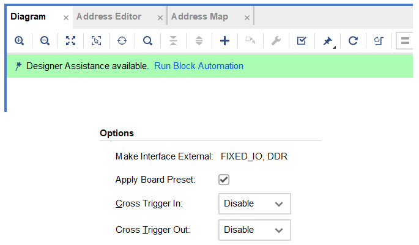


器件的选择参考[Xilinx FPGA 芯片命名规则](https://blog.csdn.net/Zenor_one/article/details/89453987)

## 按键控制LED实验

本实验使用 Vivado HLS 生成一个带有输入输出接口（ap_none）的IP核。学习使用C Simulation。


设计的输入有 C/C++设计， Testbench测试集 以及 Constraints（约束）/directives（指令）。我们可以使用C Testbench对C程序进行仿真验证程序输出的正确性，也就是C Simulation， 此C Testbench也可以用来对综合后得到的RTL设计进行仿真，也即C/RTL协同仿真。

HLS规定了 **协议、端口类型和方向**之间的相关性，在HLS开发过程中，考虑C/C++函数参数的类型是十分重要的。Vitis HLS规定可以 传入/传出 C/C++ 函数的值有四种不同的数据类型，分别是**变量、指针、数组和引用**。一种特定的参数类型只对应有限的几种协议，如：传入一个数组作为形参，能使用的协议只有：ap_hs, ap_memory, bram, ap_fifo, ap_bus, axis 和 m_axi, 其中 ap_memory是默认的，参数类型对应的接口协议如下：


D：表示default，表示HLS工具默认综合出来的接口类型；
S：表示support，表示HLS工具支持综合出来的接口类型；

使用ap_none协议且**变量作为形参**时，接口只能被综合成输入（I）接口而不能被综合成输出接口。而指针变量作为形参则可以被综合成输入、输出和双向端口。


## 呼吸灯

本实验使用HLS生成一个带有AXI4-Lite总线接口的IP核。学习使用 C/RTL Simulation 协同仿真。在ZYNQ PS端通过AXI4-Lite总线来配置呼吸灯IP核的频率和开关。

AXI的英文全称是 Advanced eXtensible Interface，即高级可扩展接口，它是ARM公司所提出的 AMBA(Advanced Microcontroller Bus Architecture)协议的一部分。 AXI协议包含了 AXI4、 AXI4 Lite和 AXI Stream三种协议。

AXI4 协议支持突发传输，主要用于处理器访问存储器 等需要指定地址的高速数据传输场景。AXI4-Lite为外设提供单个数据传输，主要用于访问一些低速外设中的 寄存器。
AXI-Stream 接口则像 FIFO 一样，数据传输时 不需要地址，在主从设备之间直接**连续读写数据**，主要用于如视频、高速AD、PCIe、DMA接 口等需要高速数据传输的场合。

AXI4 -Lite 接口是简化版的 AXI4 接口，用于较少数据量的存储映射通信。本次实验只需要配置呼吸灯IP核的频率和 开关 ，因此接口类型选择 AXI4-Lite 接口。


## 基于xfOpenCV的中值滤波

图像的频率指的是空间频率，它和我们认知的物理频率是不同的。图像的频率是表征图像中**灰度变化剧烈程度**的指标，是灰度在平面空间上的梯度。不同频率信息在图像结构中有不同的作用。

图像的主要成分是低频信息，它形成了图像的基本灰度等级，对图像结构的决定作用较小；
中频信息决定了图像的基本结构，形成了图像的主要边缘结构；
高频信息形成了图像的边缘和细节，是在中频信息上对图像内容的进一步强化。

中值滤波是一种基于排序统计理论的非线性信号处理技术，它可以消除孤立的噪声点，从而让图像中的像素值更接近真实值。红外图像中的盲元就是一种孤立噪点的例子，如下图所示：

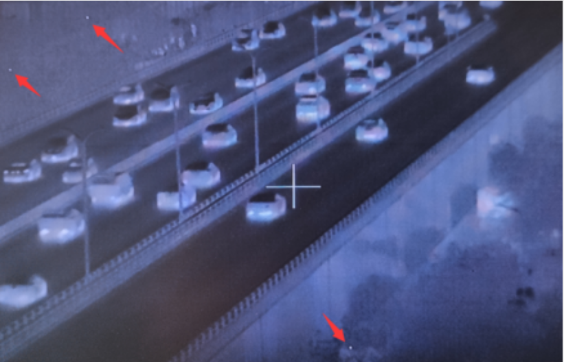

由于红外探测器制造过程中的缺陷，传感器中某些像元的输出可能会非常大，导致图像中对应的像素点非常亮，我们称之为盲元。盲元在图像中属于脉冲噪声，中值滤波对这类脉冲噪声具有良好的滤除作用，特别是在滤除噪声的同时，能够保护信号的边缘，使之不被模糊。这些优良特性是线性滤波方法所不具备的。

```c++
1  #include "ov5640_median_filter.h"
2  
3  void ov5640_median_filter(
4          hls::stream< ap_axiu<24,1,1,1> >& _src,
5          hls::stream< ap_axiu<24,1,1,1> >& _dst
6          ){
7  
8  #pragma HLS INTERFACE axis register both  port=_src
9  #pragma HLS INTERFACE axis register both  port=_dst
10 #pragma HLS INTERFACE ap_ctrl_none port=return
11 #pragma HLS dataflow
12 
13     //定义xf::mat格式变量
14      xf::Mat<XF_8UC3, HEIGHT, WIDTH, XF_NPPC1> imgInput1;
15      xf::Mat<XF_8UC1, HEIGHT, WIDTH, XF_NPPC1> imgGray;
16      xf::Mat<XF_8UC1, HEIGHT, WIDTH, XF_NPPC1> imgMedian;
17      xf::Mat<XF_8UC3, HEIGHT, WIDTH, XF_NPPC1> imgOutput1;
18 
19 #pragma HLS stream variable=imgInput1.data dim=1 depth=1
20 #pragma HLS stream variable=imgGray.data   dim=1 depth=1
21 #pragma HLS stream variable=imgMedian.data dim=1 depth=1
22 #pragma HLS stream variable=imgOutput1.data dim=1 depth=1
23 
24     //将AXI Stream格式的视频转成xf::mat格式
25     xf::AXIvideo2xfMat(_src, imgInput1);
26 
27     //将RGB格式图像转成灰度图像
28     xf::rgb2gray<XF_8UC3,XF_8UC1,HEIGHT, WIDTH, XF_NPPC1>(imgInput1, imgGray);
29 
30     //对灰度图像进行中值滤波
31     xf::medianBlur<3,XF_BORDER_REPLICATE,XF_8UC1,HEIGHT, WIDTH, XF_NPPC1>
32         (imgGray, imgMedian);
33 
34     //将灰度图像转成RGB三个通道的灰度图像
35     xf::gray2rgb<XF_8UC1,XF_8UC3,HEIGHT, WIDTH, XF_NPPC1>(imgMedian,imgOutput1);
36 
37     //将xf::mata格式的图像转成AXI Stream格式
38     xf::xfMat2AXIvideo(imgOutput1, _dst);
39 }
```

参数NPC表示每个时钟处理的像素个数（Number of pixels per clock），在代码中设置为XF_NPPC1，表示每个时钟处理一个像素。

代码的19至22行的编译指令用于指示xf::Mat格式变量中的**data成员**使用**流（stream）数据来通信**，**即采用FIFO**来实现，而**不是默认的RAM**。后面的选项**dim=1**表示用于转换成FIFO的数组是一维的，**depth=1**表示**FIFO的深度为1**。在应用**dataflow**优化时，**多个函数之间**以**流水线的形式**处理**图像数据流**，因为每个时钟只处理一个像素，因此FIFO的深度没有必要太大，设置成1可以减少FPGA存储资源的消耗。

以上参考自[基于xfOpenCV的中值滤波实验](https://www.amobbs.com/thread-5740463-1-1.html)


# 基础

## VDMA

VDMA用于将AXI Stream格式的数据流转换为Memory Map格式或者将Memory Map格式的数据转换为AXI Stream数据流，也就是说VDMA内核旨在提供从AXI4域到AXI4-Stream域的视频读/写传输功能，从而实现系统内存（DDR3）和基于AXI4-Stream的目标视频IP之间的高速数据移动。

VDMA框图如下：
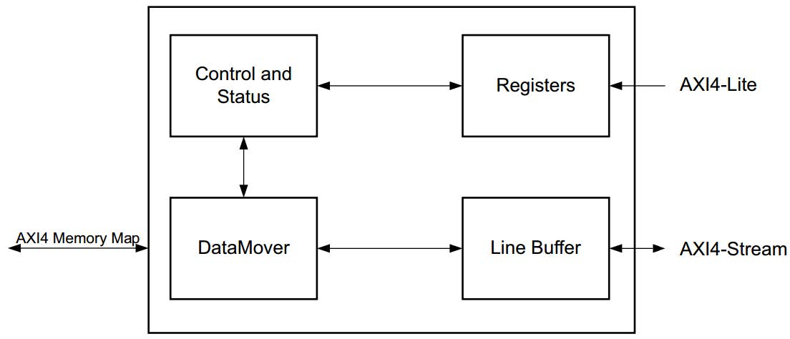

### 同步锁相（Genlock）

在很多的视频应用中，图像输入端和输出端的数据传输速率不匹配 ，通常使用帧缓存来避免因速率不匹配而导致的潜在错误。为了解决单帧缓存区域带来的图像叠加问题，通过分配多个帧缓存区域来保存数据，图像输入端在写入其中一个帧缓存时，输出端读取其它的帧缓存。

VDMA支持四种同步锁相模式，分别是Genlock Master （同步锁相主模式）、Genlock Slave（同步锁相从模式）、Dynamic Genlock Master（动态同步锁相主模式）和 Dynamic Genlock Slave （动态同步锁相从模式）。VDMA 有一个写通道（ S2MM ）和一个读通道 MM2SMM2S），用户通过写通道将输入端数据写入帧缓存，通过读通道将从帧缓存中读出数据，VDMA 的每一个通道都可以选择以上四种模式中的一种。


## 驱动ov5640

emio编号从54开始数，根据emio的宽度，如果宽度为2，则引脚编号分别为54、55。

OV5640和OV7725都是采用SCCB接口总线来配置寄存器，但不同的是，OV7725使用8位（一个字节）来表示寄存器地址，OV5640使用16位（两个字节）来表示寄存器地址。

OV5640 SCCB写传输协议：
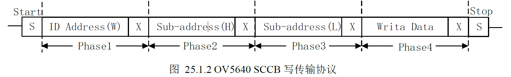

ID ADDRESS 由七位器件地址和一位读写控制位构成（0：写，1：读），七位在前，所以读写时需要发送不同的ID ADDRESS。

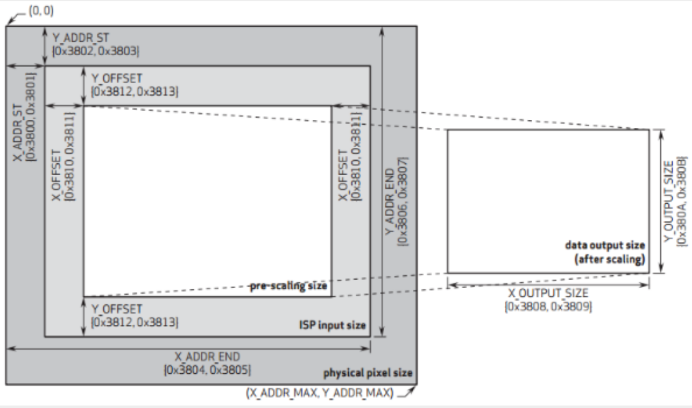

### ISP 图像信号处理

**ISP输入窗口设置（ISP Input Size）** 允许用户设置整个传感器显示区域（physical pixel size，2632\*1951，其中2592\*1944像素是有效的），开窗范围从0\*0~2632\*1951都可以任意设置，也就是上图中的**X_ADDR_ST**（寄存器地址0x3800、0x3801）、**Y_ADDR_ST**（寄存器地址0x3802、0x3803）、**X_ADDR_END**（寄存器地址0x3804、0x3805）和**Y_ADDR_END**（寄存器地址0x3806、0x3807）寄存器。该窗口设置范围中的像素数据将进入ISP进行图像处理。
**预缩放窗口设置（pre-scaling size）** 允许用户在ISP输入窗口的基础上进行裁剪，用于设置将进行缩放的窗口大小，该设置**仅在ISP输入窗口内进行X/Y方向的偏移**。可以通过**X_OFFSET**（寄存器地址0x3810、0x3811）和**Y_OFFSET**（寄存器地址0x3812、0x3813）进行配置。
**输出大小窗口设置（data output size）** 是在**预缩放窗口**的基础上，经过内部DSP进行缩放处理，并将处理后的数据输出给外部的图像窗口，**图像窗口控制着最终的图像输出尺寸**。可以通过**X_OUTPUT_SIZE**（寄存器地址0x3808、0x3809）和**Y_OUTPUT_SIZE**（寄存器地址0x380A、0x380B）进行配置。注意：当**输出大小窗口与预缩放窗口比例**不一致时，图像将进行缩放处理（图像变形），仅当两者比例一致时，输出比例才是1:1（正常图像）。

**总结就是：**
ISP输入窗口范围由\[Y_ADDR_ST : Y_ADDR_END][X_ADDR_ST : X_ADDR_END]确定；预缩放窗口在ISP基础上进行X/Y方向的偏移，偏移大小由X_OFFSET和Y_OFFSET确定；输出大小窗口同时也是OV5640输出给外部的图像尺寸，也就是显示在显示器上的图像大小，输出大小窗口由\[X_OUTPUT_SIZE][Y_OUTPUT_SIZE]直接确定；需要注意的是，输出大小窗口由预缩放窗口缩放而来，如果二者不成比例，那么显示器上看到的图像将会变形。

```c++
sccb_write_reg16(0x380c, total_h_pixel >> 8    );  //水平总像素大小高5位
sccb_write_reg16(0x380d, total_h_pixel & 0x00FF);  //水平总像素大小低8位
sccb_write_reg16(0x380e, total_v_pixel >> 8    );  //垂直总像素大小高5位
sccb_write_reg16(0x380f, total_v_pixel & 0x00FF);  //垂直总像素大小低8位

//X_OUTPUT_SIZE
sccb_write_reg16(0x3808, cmos_h_pixel >> 8     );  //DVP 输出水平像素点数高4位
sccb_write_reg16(0x3809, cmos_h_pixel & 0x00FF );  //DVP 输出水平像素点数低8位

//Y_OUTPUT_SIZE
sccb_write_reg16(0x380a, cmos_v_pixel >> 8     );  //DVP 输出垂直像素点数高3位
sccb_write_reg16(0x380b, cmos_v_pixel & 0x00FF );  //DVP 输出垂直像素点数低8位

```


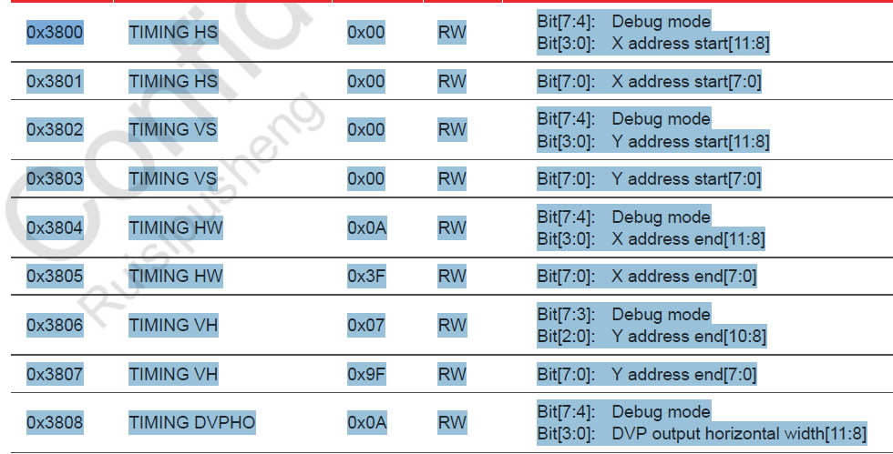

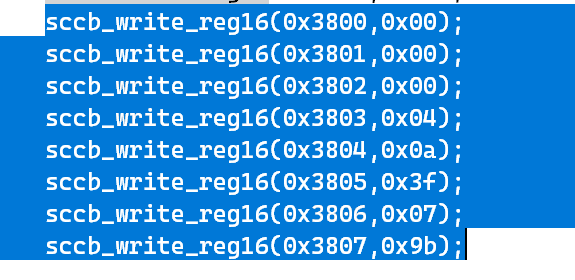

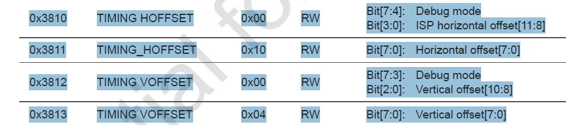

我配置的摄像头只能显示一半，对于我左手边的部分在显示屏上不能显示，正对摄像头时人像显示在显示器的边缘。


## 色彩空间

YUV（YCbCr）是欧洲电视系统采用的一种颜色编码方法，**Y代表明亮度**（luminance或luma），也就是灰阶值，**U与V表示色度**，用于描述影像的饱和度与色调。RGB与YUV的转换实际上是**色彩空间的转换**，即将RGB的三原色色彩空间转换为YUV所代表的亮度与色度的色彩空间模型。YUV主要用于模拟系统，而YCbCr则是经过校正的主要应用于数字视频中的一种编码方法，**YCbCr适用于计算机用的显示器**。
RGB着重于人眼对色彩的感知，YUV则着重于视觉对于亮度的敏感程度。。使用 YUV 描述图像的好处在于，（ 1）亮度 Y 与色度 U、V 是独立的 ；（2）人眼能够识别数千种不同的色彩，但只能识别 20多种灰阶值，采用 YUV 标准可以降低数字彩色图像所需的储存容量。因而 数字彩色图像所需的储存容量。因而YUV 在数字图像处理中是一种很常用的颜色标准。

YUV信号的提出，是因为国际上出现彩色电视，为了兼容黑白电视的信号而设计的， 在视频码率，压缩，兼容性 等方面有很大优势，我们最常用的主要是**YUV4:4:4**和 **YUV 4:2:2**两种采样格式的 YUV 信号。
下面我们将介绍这两种格式的信号:
> - YUV4:4:4
在YUV4:4:4中，YUV 三个信道的采样率相同。因此在生成的图像里，每个像素都有各自独立的三个分量，每个分量通常为8bit，故每个像素占用3个字节。下图为 YUV444 单个像素的模型图，可以看出，每个Y都对应一组U、V数据 ，共同组成一个像素。
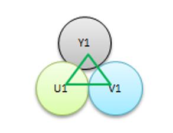
> - YUV4:2:2
在 YUV4:2:2格式中， U和 V的采样率是 Y的一半 （两个相邻的像素共用一对 U、V数据 ）。如 下图 所示，图中包含 两个相邻的像素 。第一个像素的三个YUV 分量分别是 Y1、U1、V1，第二个像素 的三个YUV 分量分别是 Y2、U1、V1，两个像素共用一组 U1、V1。
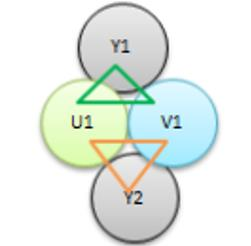

YUV4:4:4格式和 YUV4:2:2格式的**数据流**也是不同的。 数据流也是不同的。如一组连续的四个像素 P1、P2、P3、P4，采用 YUV444 的采样格式时 ，数据流为 Y0 U0 V0 、Y1 U1 V1 、Y2 U2 V2 、Y3 U3 V3 ，每组数据代表一个像素点。
而用 YUV422 的采样格式时，数据流为 **Y0 U0 Y1 V1 、Y2 U2 Y3 V3** 。其中， Y0 U0 Y1 V1 表示 P1、P2两 个像素， Y2 U2 Y3 V3 表示 P3 、P4 两个像素。

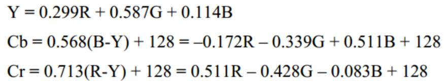

实际上 OV5640 本身支持输出 RGB 、YUV 格式的数据，当摄像头设置为 RGB565 格式，需要显示器显示灰度图时，我们只需要将**转换后的Y值作为 R、G、B 三原色通道的输入**就可以实现了。尽管摄像头设置为RGB565格式，图像采集模块一般采用低位补0的方法使输出的数据为RGB888格式一共24位，如果采用了rgb2ycbcr模块，输出的也是24位的YCbCr数据。

### 论文（连通域在复杂背景肤色检测中的应用）

在对YCbCr空间和YCgCr空间中的肤色进行**建模检测**的基础上，引入连通域进行二次检测，以此消除背景中小面积类肤色区域对检测结果的影响。

传统肤色检测方法主要分为两步：**颜色空间变换和肤色建模**，具有认知属性的、可以将亮度和色度分开处理的颜色空间有利于肤色检测。目前常用的色度与亮度相互独立的色彩空间有YUV，YCbCr。

肤色检测获得的二值化图像中，同一目标的像素通常具有连通性，为提取肤色特征，可根据像素的连通性采用**连通域标记算法区分出不同的目标**。

> - **肤色建模**
通过分析肤色数据集中的各种肤色像素的颜色信息来确定不同肤色模型中的模型参数，将建好的模型运用到具体的图像中来判断图像中的色像素是否为肤色像素。针对YCbCr
建立椭圆模型来对肤色进行检测。
将肤色样本在YCbCr颜色空间中进行统计，得到分布如下：
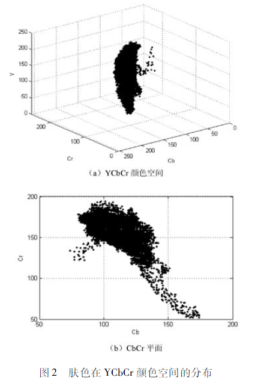
可以看出，肤色的亮度Y分布不具备聚集性，而色度分布则聚集在一个较小的范围内，如Cr值分布范围大致在100~200，Cb值大致分布在80~140之间，同时，肤色在CbCr平面的分布近似于一个椭圆，可用椭圆进行模拟。
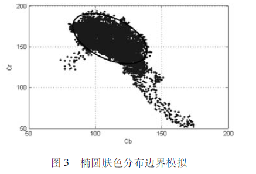
可得椭圆的表达式如下：
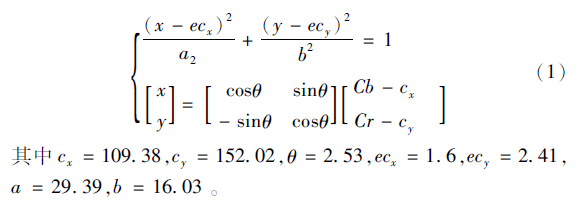
通过此椭圆表达式即建立了一个检测肤色的椭圆模型，通过颜色空间变换后的Cb,Cr值求出x,y坐标，通过判断坐标是否位于椭圆区域之内来判断其是否属于肤色。上式左边<=1则为肤色，反之不属于肤色。此时可二值化。


### 论文（实时 FPGA 手势识别 算法的设计）

本文从图像识别技术进行研究，从**手势边缘与肤色信息**出发，借助FPGA平台的高速特性，在**Sobel边缘提取算法**的基础上，提出利用**椭圆颜色域分离法与高斯函数加权来优化手势信息特征值提取**的算法。
原始图像**分别**输入 **Sobel 边缘提取模块**与**色彩空间分离模块**，经处理后的信号**共同输入高斯加权模块**，**与肤色相关的边缘信息**得到加强 ，无关信息得到抑制。 该算法 结合了手势图像的色彩信息与边缘信息，经过对比验证， 表明通过对**边缘与肤色信息**的算法优化 ，能有效滤去与手势无关的信息 ，在不同光照下测试均获得足够的辨识度 。

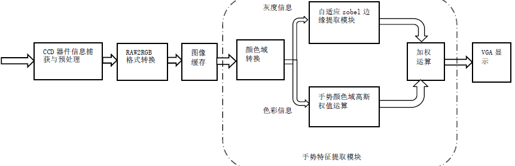

首先对手势信息的色彩域进行分析，发现手势信息色彩域集中在一个椭圆区域，为了保证一定的**环境适应性**，采用**二维高斯函数**对**手势的色彩域**进行权值计算，最后**高斯加权**到**Sobel边缘提取算法输出的边缘信息**中，实现了针对60fps下对手势边缘信息的提取和无关边缘信息的过滤。

---

为使用sobel算法，先将RGB信号转化为灰度值，先求Y值。
对于色彩域分离，需要考虑将手部的肤色尽可能落在色彩空间的一小片区域里。采用YCgCr色彩空间并且修改色彩信息转换公式，摄像头获取的样本经过计算，可见手部肤色形成的聚类可近似用一个**椭圆域**进行描述。通过**二维高斯函数**使得颜色值落在此椭圆域里的像素获得较高的增益，远离此椭圆域的像素被抑制，实现了肤色的提取。
高斯函数的拟合思路为：
- 先求聚类区域**包络椭圆曲线**。
- 对得到的椭圆曲线匹配相应的二维高斯函数，使在椭圆域边界处的像素的像素值对应的权值为1。

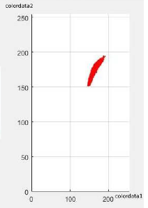
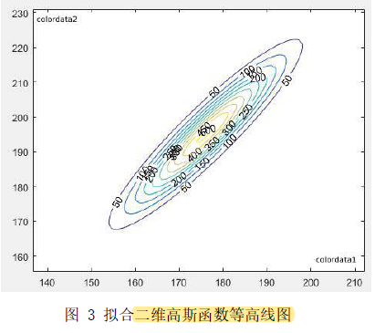

采用的二维高斯模型为：

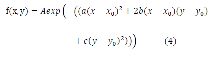
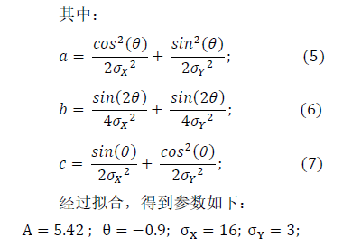

---

**自适应 sobel 边缘提取 模块设计**

前面提到，灰度信息会从颜色域转换模块输出。灰度信息输入自适应sobel边缘提取模块，该模块**目的在于提取出图像中的所有边缘信息**。( **中值滤波**可以有效滤除脉冲噪声中值滤波可以有效滤除脉冲噪声，对高斯噪声也有一定的滤波效果，能够很好地保持边缘特性，**Sobel 算子**计算简单，对噪声有一定的平滑作用，能够提供较为准确的边缘方向信息。)

sobel边缘提取算法可以参考

sobel模块输出的值将通过阈值判断进行二值化处理，这里的阈值为**中值滤波的输出值**，用于实现**自适应机制**。

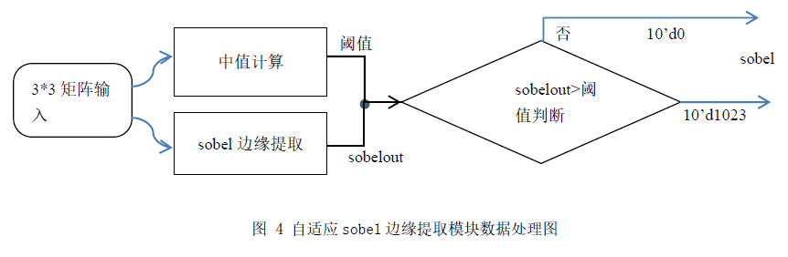

---

**加权运算模块设计**


## 算法

代码的第16 行“addr_win”缓存了图像像素的灰度值，
代码的第19行“hist_win”缓存了图像像素出现的个数，这里NUM_STATUS 定义成4 表示我们缓存的大小是4。
代码的第58 行是读取输入像素的灰度值并存储到“tempsrc”中，代码的第59 行是通过三目运算符，判断输入图像像素值与阈值之间的大小，

用到的优化指令：
在代码的第34 行“pragma HLS UNROLL”是HLS 优化指令，表示我们展开循环创建多个独立的操作，这将会导致我们可以在单个时钟周期里并行执行for 循环中的操作，而基于处理器的架构导致它执行这些操作步骤都是串行执行的。在FPGA 内部数据可以并行处理，这体现了用FPGA 并行加速的优势。

在代码的第52 行“pragma HLS PIPELINE”是为了提高吞吐率而进行的优化。“PIPELINE”指的是流水线操作，流水线操作允许操作同时发生，任务可以不必在开始下一个操作之前完成所有操作。流水线可以应用于函数和循环。

### sobel

边缘检测和区域划分是图像分割的两种不同的方法，二者具有相互补充的特点。在边缘检测中，是提取图像中不连续部分的特征，根据闭合的边缘确定区域。而在区域划分中，是把图像分割成特征相同的区域，区域之间的边界就是边缘。

由于边缘检测方法不需要将图像逐个像素地分割，因此更适合大图像的分割。边缘大致可以分为两种，一种是阶跃状边缘，边缘两边像素的灰度值明显不同；另一种为屋顶状边缘，边缘处于灰度值由小到大再到小的变化转折点处。边缘检测的主要工具是边缘检测模板。边缘检测的有很多，典型的有索贝尔算子、普里维特算子、罗伯茨交叉边缘检测等边缘检测技术，这里用的是sobel算子。

**索贝尔算子**（Sobel operator）主要用作边缘检测，在技术上，它是一离散性差分算子，在**图像的任何一点**使用此算子，将会产生对应的**灰度矢量或是其法矢量**。

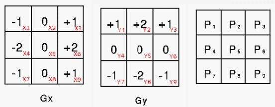

该算子包含两组 3x3 的矩阵，分别为**横向及纵向**，将之与图像作**平面卷积**，如果以 A 代表原始图像， Gx 及 Gy 分别代表**经横向及纵向边缘检测的图像灰度值**，
其公式如下：

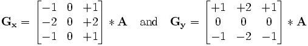

图像的**每一个像素**的**横向及纵向灰   度值**通过以下公式**结合**，来**计算该点梯度的大小**：

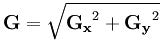

如果**梯度 G 大于某一阀值**，则认为该点(x,y)为**边缘点**。


## C++

### C++ inline内联函数
一个 C/C++ 程序的执行过程可以认为是多个函数之间的相互调用过程，它们形成了一个或简单或复杂的调用链条，这个链条的起点是 main()，终点也是 main()。当 main() 调用完了所有的函数，它会返回一个值（例如return 0;）来结束自己的生命，从而结束整个程序。

函数调用是有时间和空间开销的。程序在执行一个函数之前需要做一些准备工作，要将实参、局部变量、返回地址以及若干寄存器都压入栈中，然后才能执行函数体中的代码；函数体中的代码执行完毕后还要清理现场，将之前压入栈中的数据都出栈，才能接着执行函数调用位置以后的代码。

如果函数体代码比较多，需要较长的执行时间，那么函数调用机制占用的时间可以忽略；如果函数只有一两条语句，那么大部分的时间都会花费在函数调用机制上，这种时间开销就就不容忽视。

为了消除函数调用的时空开销，C++ 提供一种提高效率的方法，即在编译时将函数调用处用函数体替换，类似于C语言中的宏展开。这种在函数调用处直**接嵌入函数体的函数称为内联函数**（Inline Function），又称内嵌函数或者内置函数。

指定内联函数的方法很简单，只需要在函数定义处增加 inline 关键字。请看下面的例子：
```c++
#include <iostream>
using namespace std;

//内联函数，交换两个数的值
inline void swap(int *a, int *b){
    int temp;
    temp = *a;
    *a = *b;
    *b = temp;
}

int main(){
    int m, n;
    cin>>m>>n;
    cout<<m<<", "<<n<<endl;
    swap(&m, &n);
    cout<<m<<", "<<n<<endl;

    return 0;
}
```
运行结果：
45 99↙
45, 99
99, 45

注意，要在**函数定义处**添加 inline 关键字，在**函数声明处**添加 inline 关键字虽然没有错，但这种做法是无效的，编译器会忽略函数声明处的 inline 关键字。

当编译器遇到函数调用swap(&m, &n)时，会用 swap() 函数的代码替换swap(&m, &n)，同时用实参(&m, &n)代替形参(a,b)。这样，程序第 16 行就被置换成：
```c++
int temp;
temp = *(&m);
*(&m) = *(&n);
*(&n) = temp;
```
编译器可能会将 *(&m)、*(&n) 分别优化为 m、n。

当函数比较复杂时，函数调用的时空开销可以忽略，大部分的 CPU 时间都会花费在执行函数体代码上，所以我们一般是将非常短小的函数声明为内联函数。

由于内联函数比较短小，我们通常的做法是省略函数原型，将整个函数定义（包括函数头和函数体）放在本应该提供函数原型的地方。下面的例子是一个反面教材，这样的写法是不被推荐的：
```c++
#include <iostream>
using namespace std;

//声明内联函数
void swap1(int *a, int *b);  //也可以添加inline，但编译器会忽略

int main(){
    int m, n;
    cin>>m>>n;
    cout<<m<<", "<<n<<endl;
    swap1(&m, &n);
    cout<<m<<", "<<n<<endl;

    return 0;
}

//定义内联函数
inline void swap1(int *a, int *b){
    int temp;
    temp = *a;
    *a = *b;
    *b = temp;
}
```
使用内联函数的缺点也是非常明显的，编译后的程序会存在多份相同的函数拷贝，如果被声明为内联函数的函数体非常大，那么编译后的程序体积也将会变得很大，所以再次强调，一般只将那些短小的、频繁调用的函数声明为内联函数。

最后需要说明的是，对函数作 inline 声明只是程序员对编译器提出的一个建议，而不是强制性的，并非一经指定为 inline 编译器就必须这样做。编译器有自己的判断能力，它会根据具体情况决定是否这样做。

---

关于函数原型：
函数原型（Function Prototype）：即函数声明给出了函数名、返回值类型、参数列表（重点是参数类型）等与该函数有关的信息。

函数原型的作用：告诉编译器与该函数有关的信息，让编译器知道函数的存在，以及存在的形式，即使函数暂时没有定义，编译器也知道如何使用它。

有了函数声明，函数定义就可以出现在任何地方了，甚至是其他文件、静态链接库、动态链接库等。但是如果函数本身带static修饰，那么作用域是当前文件，从声明位置或者定义位置，到文件结尾。如果函数没有static，那么作用域为整个工程或者说是项目。

有人会说：将函数原型删去，并且直接在原来的位置上使用函数定义，对程序本身的使用是没有任何影响的。
事实上举个简单例子：当两个函数互相调用的时候，函数原型的作用就凸显出来了。

对于单个源文件的程序，通常是将函数定义放到 main() 的后面，将函数声明放到 main() 的前面，这样就使得代码结构清晰明了，主次分明。

使用者往往只关心函数的功能和函数的调用形式，很少关心函数的实现细节，将函数定义放在最后，就是尽量屏蔽不重要的信息，凸显关键的信息。将函数声明放到 main() 的前面，在定义函数时也不用关注它们的调用顺序了，哪个函数先定义，哪个函数后定义，都无所谓了。

而在实际开发中，几千上万行、百万行的代码很常见，将这些代码都放在一个源文件中不仅检索麻烦，而且打开文件慢，所以必须将这些代码分散到多个文件中。对于多个文件的程序，通常是将函数定义放到源文件（.c文件）中，将函数的声明放到头文件（.h文件）中，使用函数时引入对应的头文件就可以，编译器会在链接阶段找到函数体。

我们在使用 printf()、puts()、scanf() 等函数时引入了 stdio.h 头文件，很多初学者认为 stdio.h 中包含了函数定义（也就是函数体），只要有了头文件就能运行，其实不然，头文件中包含的都是函数声明，而不是函数定义，函数定义都放在了其它的源文件中，这些源文件已经提前编译好了，并以动态链接库或者静态链接库的形式存在，只有头文件没有系统库的话，在链接阶段就会报错，程序根本不能运行。

### C++ 模板

类模板可定义一系列相关性，这些类基于在实例化时传递到类的类型参数，函数模板定义的是一系列函数，利用函数模板，你可以指定基于相同代码但作用于不同类型或类的函数集。


# How to Use Vitis Vision Library

自从Xilinx推出Vivado HLS以来，越来越多的工程师，尤其是软件工程师开始转向FPGA设计与开发这一领域。其中一个主要原因是通常这些软件工程师都具有较为深厚的C/C++功底，这给他们的开发带来了一定的优势，但毕竟最终在FPGA上运行的是实实在在的电路，需要获得更高的性能就要对**工具使用方法、器件结构、面向HLS的C/C++代码风格、各种pragma（Directive）、各种优化流程与优化方法**都要有所了解。为此，Xilinx在推出这个工具的同时，也发布了相应的教程和用户指南。

**ug871**

ug871可以说是入门级首选教程。该教程讲解详细，案例丰富，非常适合初学者。该教程共11章，22个实验，可以帮助工程师理解HLS基本概念，掌握Vivado HLS工具设计流程、接口综合、任意精度数据类型、设计分析方法、设计优化方法、设计验证方法以及在IPI和System Generator中如何使用HLS的综合结果。

**ug902**

相比于只有257页的ug871，ug902多达589页，是前者的两倍还要多。因此，一页一页地翻看效率会很低。一种可行的方法是把它当作HLS的字典，在ug871中看到不明白的或者讲解不够深入的内容可以到ug902中去查阅，这样有的放矢，可以事半功倍。
有关HLS Video的介绍可以参考UG902。需要注意的是，只有在v2018.2及之前版本的UG902文档中，才对HLS视频库作了详细介绍。
之后的版本开始使用xfOpenCV库（**Xilinx xfOpenCV Library** : htps://github.com/Xilinx/xfopencv），到现在使用最新的Vitis Vision库。

**ug1270**

ug1270系统、全面地介绍了VivadoHLS的优化方法，属于高级教程，适合于已经掌握了HLS设计方法和基本的优化方法的工程师。ug1270阐述了HLS的优化方法流程，详细介绍了各种pragmas的含义，对于进一步提升工程师的HLS技能非常有帮助。

**ug1233**

如果想在Vivado HLS下使用OpenCV，可以查看ug1233。该文档对**HLS所支持的OpenCV函数**有具体说明。


**GitHub上的资源**

此外，在GitHub上，Xilinx也提供了丰富的案例。

OpenCV案例：
https://github.com/Xilinx/xfopencv


**Vivado HLS自带案例**
打开Vivado HLS，在其Welcome Page上，点击Open ExampleProject，会弹出如下界面。可以看到Example Project既包含**设计案例**也包括**代码风格相关的案例**，对于快速理解**面向HLS的C/C++代码风格**大有裨益。
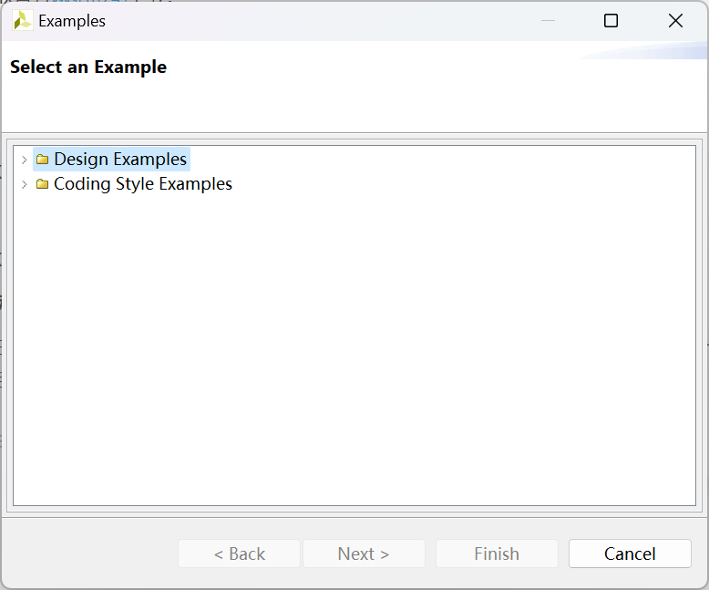

以上参考自[Vivado HLS学习资料有哪些](https://cloud.tencent.com/developer/article/1628623?from=article.detail.1652648&areaSource=106000.1&traceId=hn2Vvwr3M64KxJjVRcew3)


**Vitis HLS自带案例**
https://github.com/Xilinx/Vitis-HLS-Introductory-Examples

这些例程被分成了以下几类：
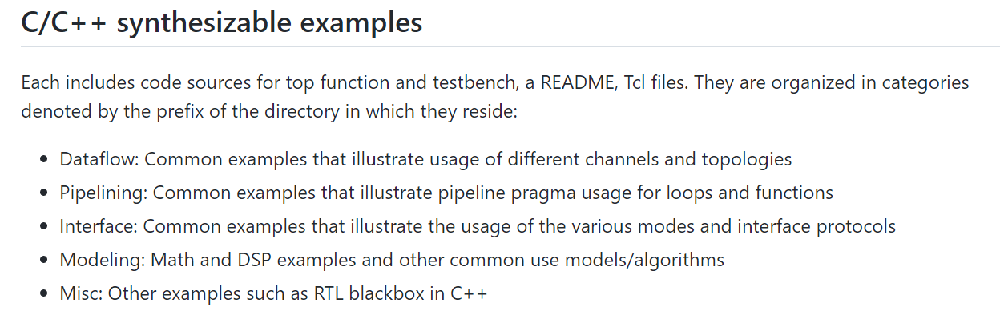

我将例程下载在`C:\Users\Admin\.Xilinx\vitis_hls\2022.2`。


**Vitis Vision Lib例程**
https://github.com/Xilinx/Vitis_Libraries/tree/master/vision
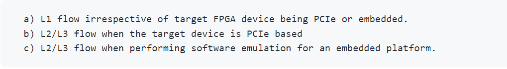
看看L1文件夹的介绍：
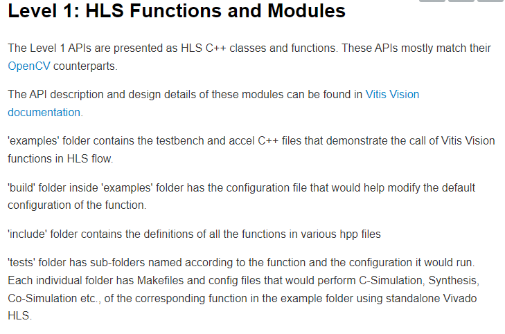

运行这些例程可以通过vitis_hls_cmd或者GUI界面来完成：
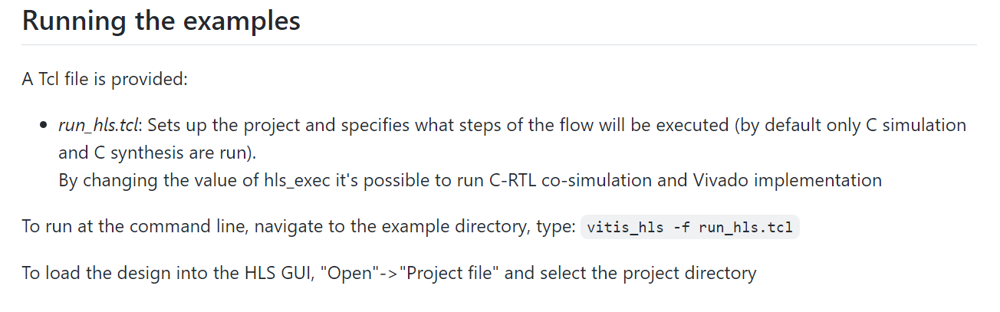
注意：需要使用vitis_hls_cmd执行该命令后生成.prj文件夹才能在Vitis HLS GUI中打开。

vitis_hls_cmd的位置应该在：
`C:\Users\Admin\AppData\Roaming\Microsoft\Windows\Start Menu\Programs\Xilinx Design Tools\Vitis_HLS 2022.2\Vitis HLS 2022.2 Command Prompt`也即
`C:\Xilinx\Vitis_HLS\2022.2\bin\vitis_hls_cmd.bat`。

运行C simulation产生csim.exe可执行文件，在目录solution1/csim/build放入要作为TB输入的图片，在此处打开终端，执行命令`./csim.exe ./param1.jpg ./param2.jpg`即可将param1.jpg和param2.jpg作为TB的输入来产生仿真结果。

**关于TB中main函数(int argc, char \*argv[])的理解**：
这两个参数实际上都是对于 **你在终端执行的命令** 的描述，要知道csim.exe就是TB编译链接后产生的可执行文件，而前文提到的命令能将两张图片传递给main函数，而如何传递呢，你输入的只是字符串呀。就靠argc和argv两个参数了，argc指示程序启动时命令行参数的个数，argv则包含具体的参数字符串，也就是用argv这个字符串数组把命令行参数存起来。注意：命令行参数要空格分隔，也就是输入`./csim.exe ./param1.jpg ./param2.jpg`这条命令时，argc=3，argv[0]=./csim.exe, argv[1]=./param1.jpg, argv[2]=./param2.jpg。通过这两个参数，程序便可以获知自身启动时的命令信息。
**参考**：
https://blog.csdn.net/fenhong91/article/details/54863718
https://blog.51cto.com/u_15338641/3630248


## 准备工作

在Windows的vitis补全只需要按下`alt + / `头文件和变量名都能补全出来

### CFLAGS
-IC:\Xilinx\Vitis_Libraries\Vitis_Libraries-main\vision\L1\include -std=c++0x -II:\Professional\opencv_lib\opencv\Latest4Vitis\install\include
**synthesis不要-std=c++0x及之后的语句**

### Linker Flags
-LI:\Professional\opencv_lib\opencv\Latest4Vitis\install\x64\mingw\lib -llibopencv_core470 -llibopencv_imgcodecs470 -llibopencv_imgproc470 -llibopencv_highgui470
需要什么库自己链接就可以了

## Vitis Vision Library API Reference

### xf::cv::Mat Image Container Class

**xf::cv::Mat** is a template class that serves as a **container for storing image data and its attributes**.

**Class Definition:**
```c++
template <int T, int ROWS, int COLS, int NPC, int XFCVDEPTH = _XFCVDEPTH_DEFAULT>
class Mat {
   public:
   unsigned char allocatedFlag; // flag to mark memory allocation in this class
   int rows, cols, size;        // actual image size

   typedef XF_TNAME(T, NPC) DATATYPE;
   using _DATATTYPE = typename std::conditional<
      (XFCVDEPTH < 0),
      DATATYPE*,                 // Case of Memory Mapped pointer
      typename std::conditional< // Case of Stream
         (XFCVDEPTH == 0),
         hls::stream<DATATYPE>,           // Case of default Dtream depth or user can override outside
         hls::stream<DATATYPE, XFCVDEPTH> // Case of Stream depth specified
         >::type>::type;
   _DATATTYPE data;

   Mat(); // default constructor
   Mat(Size _sz);
   Mat(int _rows, int _cols);
   Mat(int _size, int _rows, int _cols);
   Mat(int _rows, int _cols, void* _data);
   Mat(const Mat&); // copy constructor

   ~Mat();

   Mat& operator=(const Mat&); // Assignment operator

   template <int D = XFCVDEPTH, typename std::enable_if<(D < 0)>::type* = nullptr>
   void alloc_data() {
#ifndef __SYNTHESIS__
      data = (DATATYPE*)malloc(size * sizeof(DATATYPE));

      if (data == NULL) {
         fprintf(stderr, "\nFailed to allocate memory\n");
      } else {
         allocatedFlag = 1;
      }
#endif
   }

   template <int D = XFCVDEPTH, typename std::enable_if<(D >= 0)>::type* = nullptr>
   void alloc_data() {
      // This is a stream
   }

   template <int D = XFCVDEPTH, typename std::enable_if<(D < 0)>::type* = nullptr>
   void free_data() {
      if (data != NULL) {
#ifndef __SYNTHESIS__
         free(data);
#endif
      }
   }

   template <int D = XFCVDEPTH, typename std::enable_if<(D >= 0)>::type* = nullptr>
   void free_data() {}

   template <int D = XFCVDEPTH, typename std::enable_if<(D < 0)>::type* = nullptr>
   void copyData(const Mat& src) {
      for (int i = 0; i < (rows * ((cols + NPC - 1) >> XF_BITSHIFT(NPC))); ++i) {
         data[i] = src.data[i];
      }
   }

   template <int D = XFCVDEPTH, typename std::enable_if<(D >= 0)>::type* = nullptr>
   void copyData(const Mat& src) {
      // This is a stream
      assert(0);
   }

   template <int D = XFCVDEPTH, typename std::enable_if<(D < 0)>::type* = nullptr>
   void assignDataPtr(void* _data) {
      data = (DATATYPE*)_data;
   }

   template <int D = XFCVDEPTH, typename std::enable_if<(D >= 0)>::type* = nullptr>
   void assignDataPtr(void* _data) {
      // This is a stream
      assert(0);
   }

   template <int D = XFCVDEPTH, typename std::enable_if<(D < 0)>::type* = nullptr>
   XF_TNAME(T, NPC)
   read(int index) {
      return data[index];
   }

   template <int D = XFCVDEPTH, typename std::enable_if<(D >= 0)>::type* = nullptr>
   XF_TNAME(T, NPC)
   read(int index) {
      return data.read();
   }
   float read_float(int index);

   template <int D = XFCVDEPTH, typename std::enable_if<(D < 0)>::type* = nullptr>
   void write(int index, XF_TNAME(T, NPC) val) {
      data[index] = val;
   }

   template <int D = XFCVDEPTH, typename std::enable_if<(D >= 0)>::type* = nullptr>
   void write(int index, XF_TNAME(T, NPC) val) {
      data.write(val);
   }
   void write_float(int index, float val);

   template <int D = XFCVDEPTH, typename std::enable_if<(D >= 0)>::type* = nullptr>
   void init(int _rows, int _cols, void* _data) {
      init(_rows, _cols);
      copyTo(_data);
   }

   template <int D = XFCVDEPTH, typename std::enable_if<(D < 0)>::type* = nullptr>
   void init(int _rows, int _cols, void* _data) {
      init(_rows, _cols, false);
      assignDataPtr(_data);
   }

   void init(int _rows, int _cols, bool allocate = true);
   void copyTo(void* fromData);
   unsigned char* copyFrom();

   const int type() const;
   const int depth() const;
   const int channels() const;

   template <int DST_T>
   void convertTo(Mat<DST_T, ROWS, COLS, NPC, XFCVDEPTH>& dst, int otype, double alpha = 1, double beta = 0);
};
```

#### Class definition

>**Parameter Descriptions:**
>
>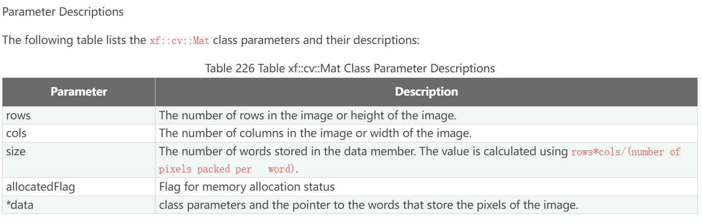
>**size**参数比较重要，描述Mat类data成员中存储的**word**数，这个数使用`rows*cols/(number of pixels packed per word)`来计算，**分母就是NPC**。Mat的data成员是一维数组，其中每个数据元素应该就是word。word应该就是pixel按NPC打包成的，一个clock传输一个word相当于传输了number of pixels。
**data** 是指向`the words that store the pixels of the image`的指针，也可以理解为data数组的数组名，指向了这个数组第一个元素。

>**member functions and their descriptions:**
>
>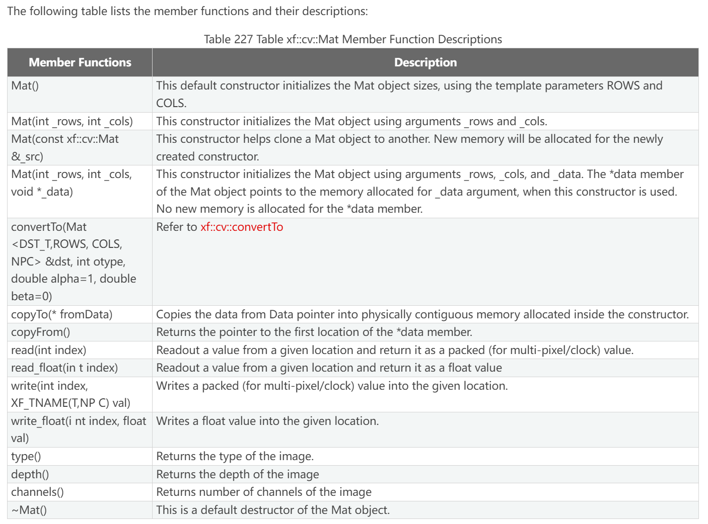

>**template parameters:**
>
>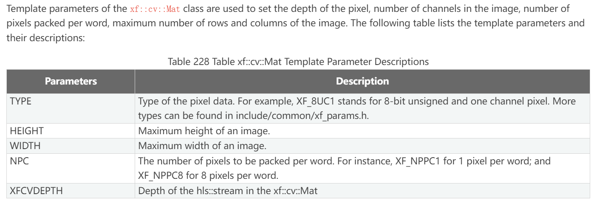
>**TYPE**：Type of the pixel data. For example, XF_8UC1 八位无符号单通道像素。
**NPC**：**The number of pixels to be packed per word**. For instance, XF_NPPC1 for 1 pixel per word; and XF_NPPC8 for 8 pixels per word.
**XFCVDEPTH**：**Depth of the hls::stream in the xf::cv::Mat**不懂。应该和Mat中定义的数据类型_DATATYPE有关。


##### Note

>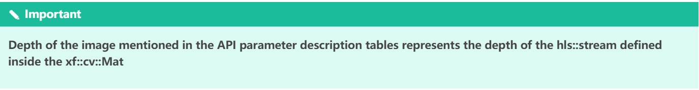
>所谓图像深度指的是定义在 xf::cv::Mat 中的 hls::stream 的深度，也就是XFCVDEPTH。


#### Parallelism

对一个函数指定并行处理的像素数

可选参数如下：
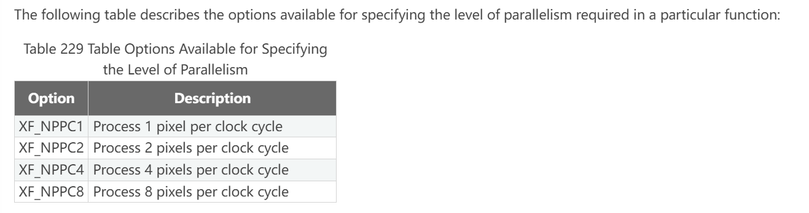

定义Parallelism会用到的两个宏：
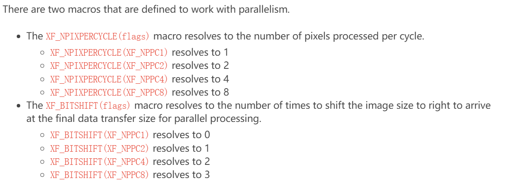
第二个宏XF_BITSHIFT的目的是解析出图像大小需要右移的次数以便得到传输次数，比如XF_NPPC8，一次传输八个像素，那传输次数便是总像素数/8，也就是总像素数>>8。


#### Data Types

像素数据类型是由像素数据深度和像素通道数结合而来的，通用命名法为：
`XF_<Number of bits per pixel><signed (S) or unsigned (U) or float (F)>C<number of channels>`
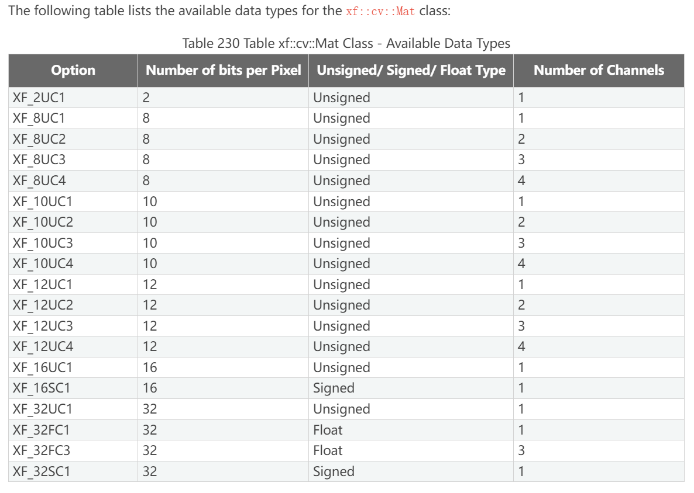


##### Manipulating Data Type

基于 number of pixels to process per clock cycle 和 Data Types of Pixel，视觉库使用了一些数据类型用于xf::cv::Mat以及内部数据处理，举例如下：
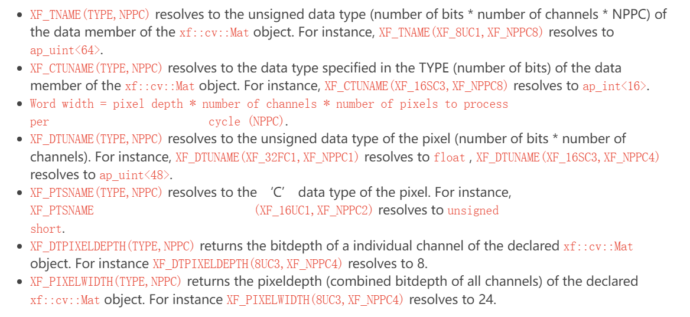

For more information, see the Vitis HLS User Guide: High-Level Synthesis (UG1399 ).


###### Note

ap_uint<>, ap_int<>, ap_fixed<>, and ap_ufixed<> types belong to the high-level synthesis (HLS) library.


#### Class Function

- xf::cv::imread  从文件读图
- xf::cv::imwrite  将图像写入文件中
- xf::cv::absDiff
- xf::cv::convertTo
详见[Class function](https://docs.xilinx.com/r/en-US/Vitis_Libraries/vision/api-reference.html_1_3)


### Vitis Vision Library Functions

The Vitis Vision library is a set of **select OpenCV functions** optimized for Zynq-7000, Zynq UltraScale+ MPSoC, Versal VCK190, Alveo U200 and U50 devices. 

#### Note
>All the functions in the library are implemented in streaming model except 7. Bounding box, Canny, Cornertracker, Crop, EdgeTracing, MeanShiftTracking, Rotate are memory mapped implemenations. These functions need to have the flag __SDA_MEM_MAP__ set for compiling correctly
>除了这七个函数使用内存映射实现的，其他的都是流模型实现的，使用这七个函数时要设置对应的flag。
>
>Default depth value for all the memory mapped implemenations(Bounding box, Canny, Cornertracker, Crop, EdgeTracing, MeanShiftTracking, Rotate) is “_XFCVDEPTH_DEFAULT = -1”. Default depth value for all the streaming model implemenations is “_XFCVDEPTH_DEFAULT = 2”.
>对于内存映射实现的默认深度值_XFCVDEPTH_DEFAULT = -1，对于流模型实现的默认深度值_XFCVDEPTH_DEFAULT = -2，这个在编程中要用到的。
>
>Number of pixel per clock depends on the maximum bus width a device can support. For example: Zynq-7000 SoC has 64-bit interface and so for a pixel type 16UC1, maximum of four pixel per clock (XF_NPPC4) is possible.
>每个时钟周期处理的像素数NPC。

具体函数介绍见[Vitis Vision Library Functions](https://docs.xilinx.com/r/en-US/Vitis_Libraries/vision/api-reference.html_2_0)


## Getting Started with HLS

### AXI Video Interface Functions

> 基本特征
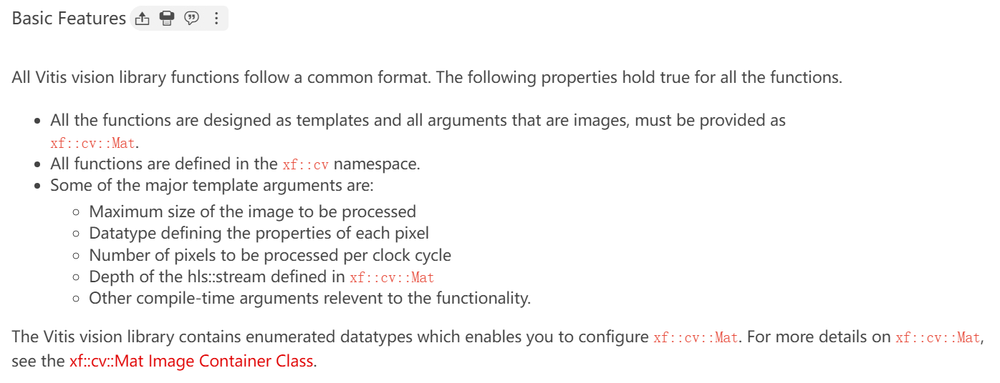


>看 Vitis Vision Library 文件夹包含的内容，table是重点
[Vitis Vision Library Contents](https://docs.xilinx.com/r/en-US/Vitis_Libraries/vision/overview.html_0_2)
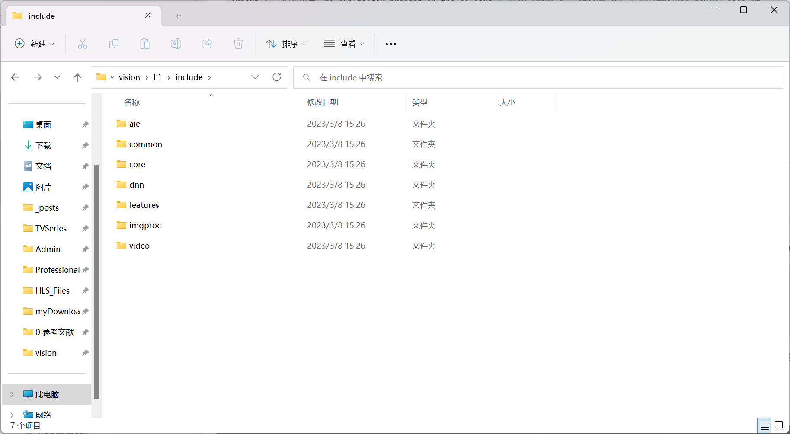


>看包含库函数的后文件及其对应的文件夹名，table是重点
[Using the Vitis vision Library](https://docs.xilinx.com/r/en-US/Vitis_Libraries/vision/overview.html_1_3)
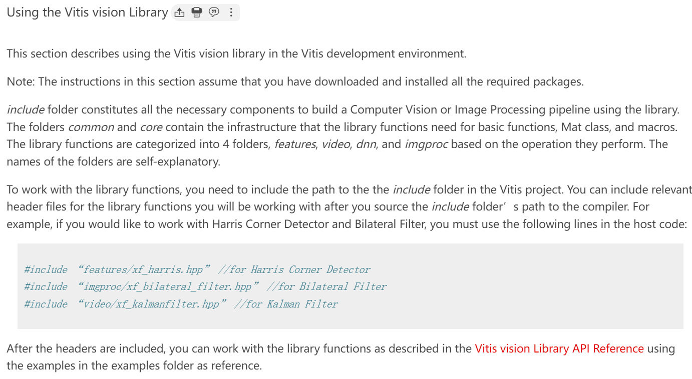
文件夹common和core包含库函数所需要的基础设施，包括`basic functions, Mat class, and macros`，库函数按类分成四个文件夹：`features, video, dnn, and imgproc `，为了使用这些库函数，必须在VitisProject中添加文件夹的路径，之后便可以include相关的头文件，应该是要添加文件夹的路径到CFlags。
比如，在添加上文的CFlags之后，在源文件中用这样的语句便可以添加头文件：
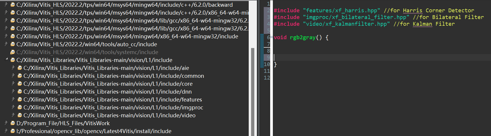


>[AXI Video Interface Functions](https://docs.xilinx.com/r/en-US/Vitis_Libraries/vision/overview.html_2_0)
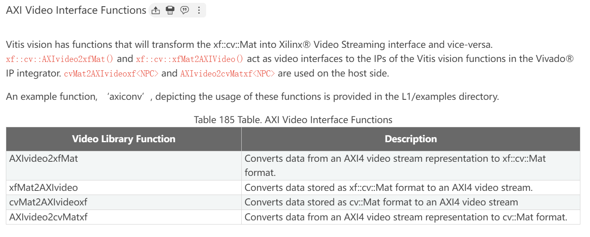

### Migrating HLS Video Library to Vitis vision

>[Migrating HLS Video Library to Vitis vision]()
HLS video视频库已经被弃用，其中所有函数和大部分的基础结构都能够在Vitis vision库中找到，但是有一些变化。
>1. 命名空间由hls::变为xf::cv::，hls::Mat使用hls::stream存储数据但是xf::cv::Mat使用指针，所以前者无法被后者完全代替。
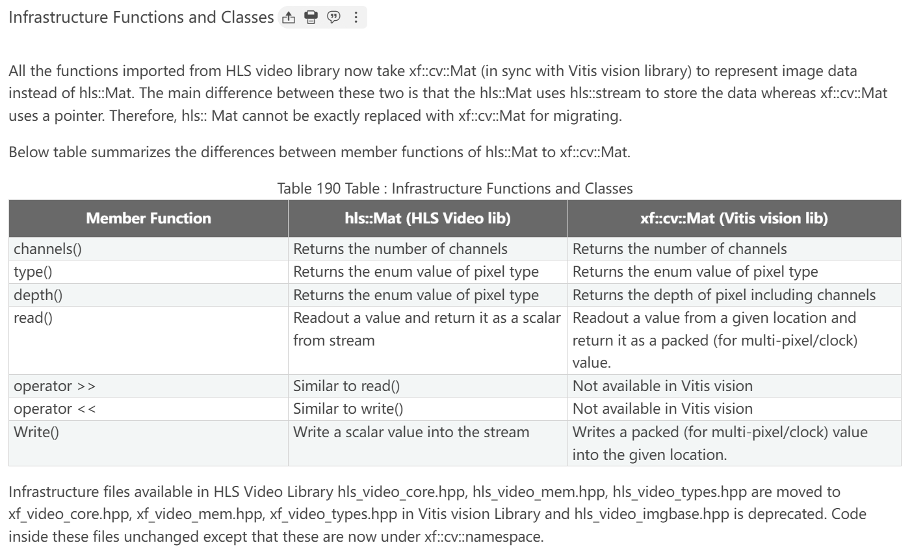
>2. hls::window 和 hls::LineBuffer 分别由xf::cv::window 和xf::cv::LineBuffer代替，定义在**xf_video_mem.h**。
>3. convert OpenCV Mat format to/from HLS AXI types在Vitis vision Lib中只剩下两个函数，分别是：cvMat2AXIvideo and AXIvideo2cvMat，定义在**xf_axi.h**。
>4. convert Mat format data to/from AXI4-Stream compatible data type 的函数原来是 hls::AXIvideo2Mat and hls::Mat2AXIvideo，已经被xf::cv::AXIvideo2xfMat and xf::cv:: xfMat2AXIvideo 替换，定义在**xf_infra.hpp**。
>5. **要使用以上这些函数，必须包含这些头文件。**
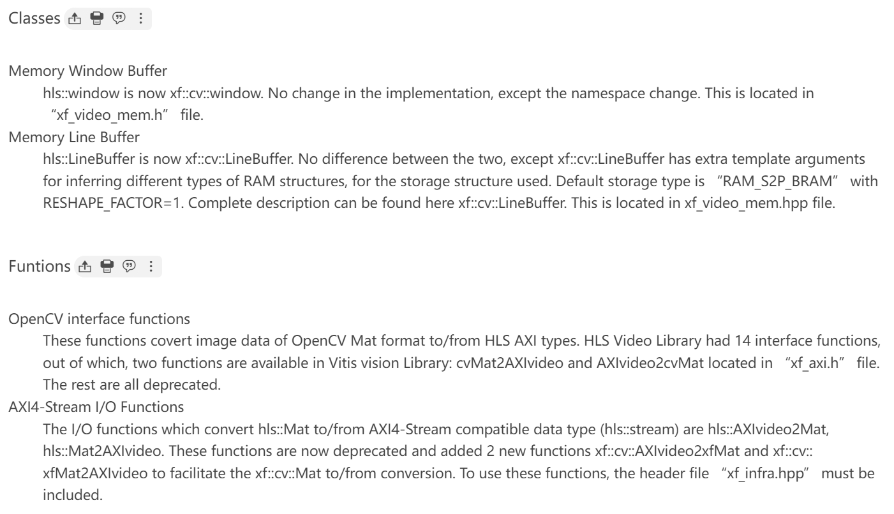


>**xf::cv::window**
一个代表二维窗口缓存的模板类，使用三个参数去定义行数，列数和像素数据类型。
类定义如下：
>```c++
>template<int ROWS, int COLS, typename T>
>class Window {
>public:
>    Window()
>   /* Window main APIs */
>    void shift_pixels_left();
>    void shift_pixels_right();
>    void shift_pixels_up();
>    void shift_pixels_down();
>    void insert_pixel(T value, int row, int col);
>    void insert_row(T value[COLS], int row);
>    void insert_top_row(T value[COLS]);
>    void insert_bottom_row(T value[COLS]);
>    void insert_col(T value[ROWS], int col);
>    void insert_left_col(T value[ROWS]);
>    void insert_right_col(T value[ROWS]);
>    T& getval(int row, int col);
>    T& operator ()(int row, int col);
>    T val[ROWS][COLS];
>#ifdef __DEBUG__
>    void restore_val();
>    void window_print();
>    T val_t[ROWS][COLS];
>#endif
>};
>```
> xf::cv::Window主要参数`val`是一个二维数组，hold the contents of buffer。
[Member Function Description](https://docs.xilinx.com/r/en-US/Vitis_Libraries/vision/overview.html_2_1_3_2)
Sample code for window buffer declaration
>```c++
>Window<K_ROWS, K_COLS, unsigned char> kernel;
>```


>**xf::cv::LineBuffer**
一个代表二维线缓存的模板类，用三个参数指定line buffer中的行数，列数和像素数据类型。
定义如下：
```c++
template<int ROWS, int COLS, typename T, XF_ramtype_e MEM_TYPE=RAM_S2P_BRAM, int RESHAPE_FACTOR=1>
 class LineBuffer {
public:
    LineBuffer()
       /* LineBuffer main APIs */
    /* LineBuffer main APIs */
    void shift_pixels_up(int col);
    void shift_pixels_down(int col);
    void insert_bottom_row(T value, int col);
    void insert_top_row(T value, int col);
    void get_col(T value[ROWS], int col);
    T& getval(int row, int col);
    T& operator ()(int row, int col);

    /* Back compatible APIs */
    void shift_up(int col);
    void shift_down(int col);
    void insert_bottom(T value, int col);
    void insert_top(T value, int col);
    T val[ROWS][COLS];
#ifdef __DEBUG__
    void restore_val();
    void linebuffer_print(int col);
    T val_t[ROWS][COLS];
#endif
};
```
>主要成员`val`表示`2-D array to hold the contents of line buffer`。
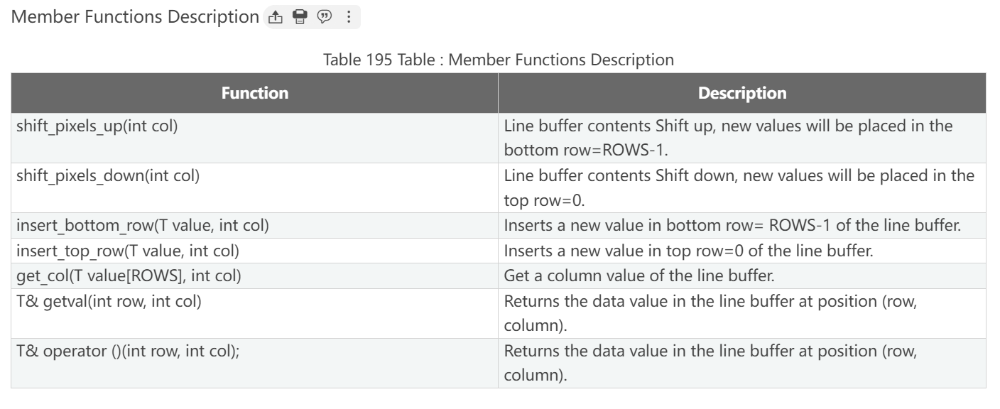
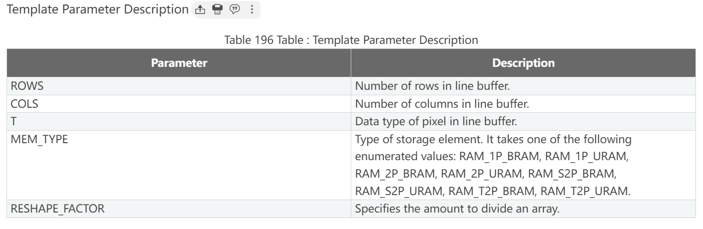
Sample code for line buffer declaration:
>```c++
>LineBuffer<3, 1920, XF_8UC3, RAM_S2P_URAM,1>     buff;
>```


>[Video Processing Functions](https://docs.xilinx.com/r/en-US/Vitis_Libraries/vision/overview.html_2_1_5)
这个table总结了从HLS Video库移植到Vitis Vision库中的视频处理函数。


## 优化指令

\#pragma HLS RESOURCE variable=input_stream core=AXIS metadata="-bus_bundle INPUT_STREAM"
\#pragma HLS RESOURCE variable=output_stream core=AXIS metadata="-bus_bundle OUTPUT_STREAM"
\#pragma HLS INTERFACE ap_ctrl_none port=return


void VID_PROC(AXI_STREAM &video_in, AXI_STREAM &video_out, int rows, int cols)
\#pragma HLS INTERFACE axis port=video_in bundle=INPUT_STREAM
\#pragma HLS INTERFACE axis port=video_out bundle=OUTPUT_STREAM
\#pragma HLS INTERFACE s_axilite port=rows bundle=CONTROL_BUS offset=0x14
\#pragma HLS INTERFACE s_axilite port=cols bundle=CONTROL_BUS offset=0x1c
\#pragma HLS INTERFACE s_axilite port=return bundle=CONTROL_BUS
\#pragma HLS dataflow
\#pragma HLS stream depth=20000 variable=OUT2.data_stream

void accumulate_accel(ap_uint<INPUT_PTR_WIDTH>* img_in1,
                      ap_uint<INPUT_PTR_WIDTH>* img_in2,
                      ap_uint<OUTPUT_PTR_WIDTH>* img_out,
                      int height,
                      int width) 
\#pragma HLS INTERFACE m_axi port=img_in1 offset=slave bundle=gmem0 depth=__XF_DEPTH
\#pragma HLS INTERFACE m_axi port=img_in2 offset=slave bundle=gmem1 depth=__XF_DEPTH
\#pragma HLS INTERFACE m_axi port=img_out offset=slave bundle=gmem2 depth=__XF_DEPTH
\#pragma HLS INTERFACE s_axilite port=return bundle=control

\#pragma HLS INTERFACE axis port=video_in bundle=INPUT_STREAM
\#pragma HLS INTERFACE axis port=video_out bundle=OUTPUT_STREAM
\#pragma HLS INTERFACE s_axilite port=return bundle=CONTROL_BUS
\#pragma HLS INTERFACE s_axilite port=rows bundle=CONTROL_BUS offset=0x14
\#pragma HLS INTERFACE s_axilite port=cols bundle=CONTROL_BUS offset=0x1C


## 看博客

[接口，优化指令]https://blog.csdn.net/xzs520xzs/article/details/126673128

在vivado HLS软件右侧中有个Directive栏（如果没有可以在功能栏中的window将其显示出来），里边列出了所有的**变量、函数、循环**结构，右键点击就可以对其进行配置；简单讲解一下如何进行配置，对于循环结构体，一般选择**unroll**（展开循环），可以自己设定展开的因子factor；对于函数，为了提高程序的并行处理能力，可以右键选择**PIPELINE**；对于数组，可以设置为**ARRAY_PARTITION**，数组维数根据需求设置。每一个优化的方案都可以保存在一个solution中，可以创建多个solution。


[HLS：接口完整学习与综合测试](https://blog.csdn.net/mmphhh/article/details/115655208)


[HLS第三十五课（XAPP1167，基于videolib实现图像处理）](https://blog.csdn.net/weixin_42418557/article/details/121130337?utm_medium=distribute.pc_relevant.none-task-blog-2~default~baidujs_utm_term~default-0-121130337-blog-75909681.pc_relevant_multi_platform_whitelistv6&spm=1001.2101.3001.4242.1&utm_relevant_index=3)

```c++
typedef hls::Mat<MAX_HEIGHT, MAX_WIDTH, HLS_8UC2>     IMAGE_C2;

void image_filter(AXI_STREAM& video_in, AXI_STREAM& video_out, int rows, int cols) {
    //Create AXI streaming interfaces for the core
#pragma HLS INTERFACE axis port=video_in bundle=INPUT_STREAM
#pragma HLS INTERFACE axis port=video_out bundle=OUTPUT_STREAM

#pragma HLS INTERFACE s_axilite port=return bundle=CONTROL_BUS
#pragma HLS INTERFACE s_axilite port=rows bundle=CONTROL_BUS offset=0x14
#pragma HLS INTERFACE s_axilite port=cols bundle=CONTROL_BUS offset=0x1C

#pragma HLS INTERFACE ap_stable port=rows
#pragma HLS INTERFACE ap_stable port=cols

    IMAGE_C2 img_0(rows, cols);
    IMAGE_C2 img_1_0(rows, cols);
    IMAGE_C2 img_1_1(rows, cols);
    IMAGE_C1 img_1_Y(rows, cols);
    IMAGE_C1 img_1_UV(rows, cols);
    IMAGE_C2 img_2(rows, cols);
    IMAGE_C1 mask(rows, cols);
    IMAGE_C1 dmask(rows, cols);
    PIXEL_C2 color(255,0);
    
#pragma HLS dataflow

#pragma HLS stream depth=20000 variable=img_1_1.data_stream
    hls::AXIvideo2Mat(video_in, img_0);
    hls::Duplicate(img_0, img_1_0, img_1_1);
    hls::Split(img_1_0, img_1_Y, img_1_UV);
    hls::Consume(img_1_UV);
    hls::FASTX(img_1_Y, mask, 20, true);
    hls::Dilate(mask, dmask);
    hls::PaintMask(img_1_1, dmask, img_2, color);
    hls::Mat2AXIvideo(img_2, video_out);
}
```

这里重点是img_1_1的使用问题。
在整体**dataflow**的情况下，**HLS对上下游任务的数据交接**，使用**FIFO**方式。
但是复制后的img_1_0和img_1_1，它们的消费速度是不同步的。
在数据路径上，img_1_0很快就被下游的任务split消费掉了。但是img_1_1却要等到更下游的paintmask处才能被消费掉。
这段时间内，duplicate仍然在不断的生产数据，同时提供给img_1_0和img_1_1。（流数据是这样的）
所以，**img_1_1需要具备足够大的FIFO depth**。
`#pragma HLS stream depth=20000 variable=img_1_1.data_stream`
这条约束，指定了**Mat对象的内部存储数组（data_stream）**，显式地被HLS理解为**FIFO（stream）**，并且深度为**20000**。


## 图像处理中的数据类型

xf::cv::Mat中存储像素数据的是成员是data，data定义如下：

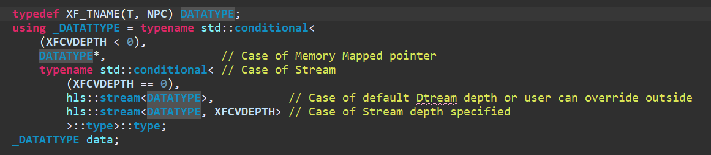

这里的T是像素数据类型，如XF_8UC3，DATATYPE是XF_TNAME(T, NPC)的别名，从前面的Manipulating Data Type章节了解到XF_TNAME(T, NPC)会解析成ap_uint<像素宽度*通道数*NPC>，如XF_TNAME(XF_8UC3, XF_NPPC1)解析成ap_uint<8*3*1>=ap_uint<24>，因此我们可以推导出DATATYPE的类型。
接着看到_DATATYPE的定义，虽然定义复杂但我们可以逐层推断，conditional相比是条件判断，程序中使用流模型所以XFCVDEPTH为默认值也就是2，进入第二层条件判断可以发现_DATATYPE被定义成了hls::stream<DATATYPE, XFCVDEPTH>::type::type，重点关注hls::stream<DATATYPE, XFCVDEPTH>。所以data也是一种流数据模型。


## 看课

[learn from here](https://www.bilibili.com/video/BV1bt41187RW/?p=1&vd_source=7b41839c0bc8f13071f01977ba9e14de)

throghput 吞吐率
注意数据位宽，原则是大数据不能溢出，小数据不能损失，尤其用定点数的时候。
HLS是不支持递归的

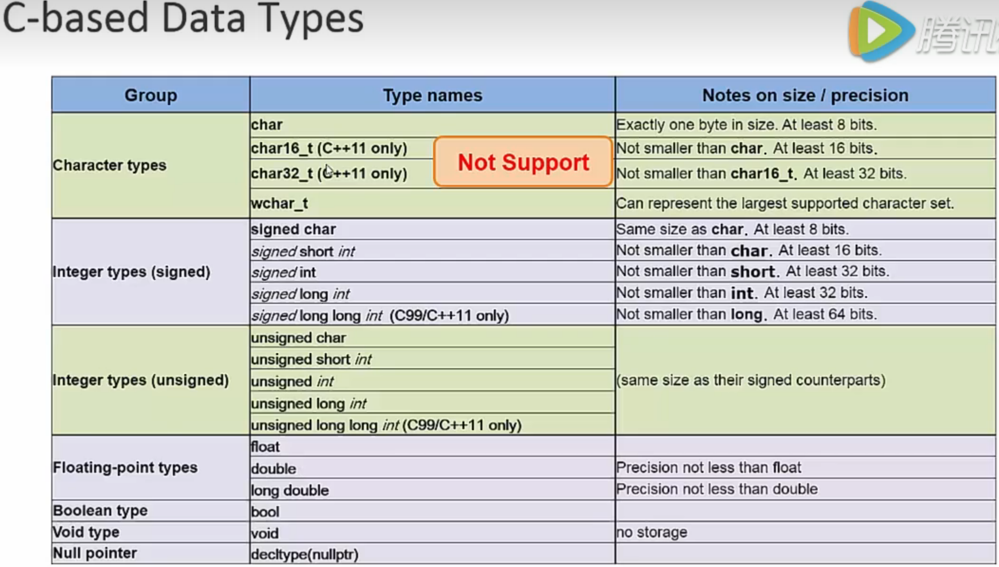
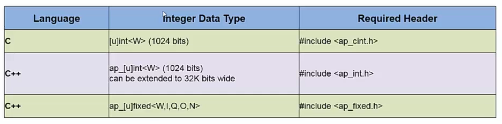
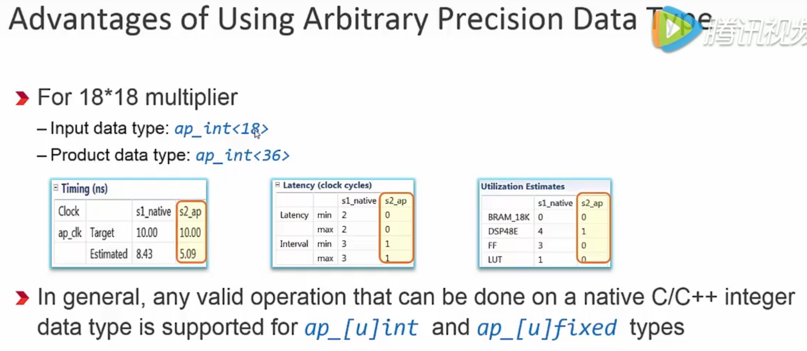
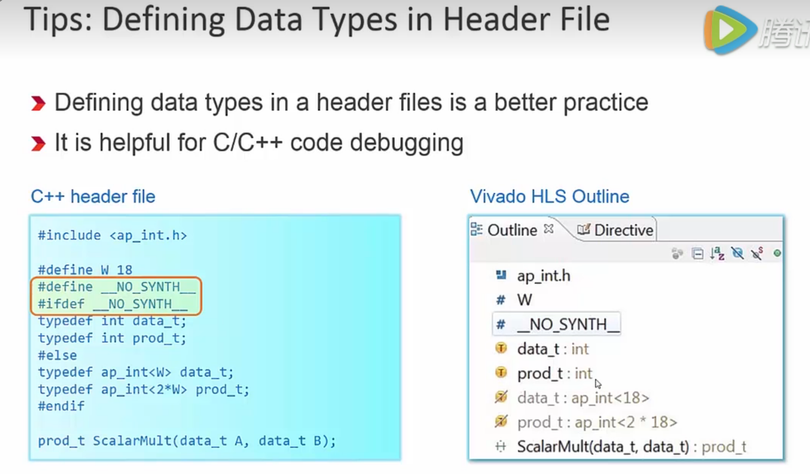


 


 


 
 
 
 
 
 
 
 
 
 
 
 
 
要使用fifo接口，需要数组本身是先进先出这种流动方式的才行。
 
 
 
 
 
 
 
折中，约束使用单端口
 
 
 
约束使用单端口RAM
 
solution resource compare
 
 
 
 
 
 
 
 
 
 
 
 
 
 
 
 
 
 
 
 
 
 
 
 
 


# 基于PYNQ软硬结合的二维手势交互设计


识别的手势包括 平移，缩放

手势识别部分主要实现了对提取的手势类型的识别，并对手势进行了定位操
作，并将手势类型与定位信息传输给手势动作解析模块。

手势交互控制信息的解析与输出部分主要结合手势识别的结果以及手势的位
置信息，做出手势动作含义的解读，将手势含义解读出来并将信息输出，用于进行相应的控制操作。

需要使用到两个图像缓存，一个是在采集图像时对图像进行缓存，另一个是在图像输出时对图像进行缓存。2 个VDMA 图像缓存模块


手势区域截取，手势特征提取，手势识别，手势参数输出。

**手势区域截取**
**基于统计规律的手势识别**
手势的基本特征主要有，手势的面积大小、手势的宽长比以及**手势部分与矩形面积的比值**


# 基于FPGA 的手势识别系统

**手势分割模块、手势特征提取模块、手型自适应模块和手势识别模块**


面积周长比，有效面积特征作为初步识别的特征参量，最后提取五阶Hu矩特征


# 基于FPGA 动态手势识别系统研究与实现


>**对于二值图像**
腐蚀：过滤无意义的小点，过滤效果与腐蚀窗口形状大小有关。
膨胀：平滑边缘线，连接断裂的边缘线，
开：先用腐蚀消除噪声点，再膨胀平滑物体的边缘
这里作者使用了两次腐蚀和一次膨胀。


如前所说，膨胀能平滑边缘，所以在Sobel边缘提取后可以使用膨胀来


# 优化

## 寻找合适的滤波窗口大小和迭代次数


中值滤波窗口3 可行
腐蚀窗口 5
腐蚀迭代 3

膨胀窗口 5
膨胀迭代 5
效果不错，尝试过了3333，可以再试试减少迭代次数
腐蚀膨胀窗口越大，迭代次数越多对小目标效果越好
这些其实效果都不好，仿真还行，生成ip核效果并不好，所以还是都用最小的值吧。


## Hu不变矩
对于一个提取出来的手势，我们需要有固定且唯一的特征来对其进行记录，且该特征不会受到手势的大小，旋转，平移而变化，且鲁棒性较好，所以此处引入Hu不变矩算法。

>连续情况下，图像像素分布为f(x,y)，则图像的p+q阶不变矩（标准矩，普通矩）为：

p+q阶中心矩为：

其中矩心（x0, y0）为：


>对于数字图像，引入适用于离散图像的Hu不变矩：

式中p、q=0，1，2...

直接用普通矩或中心矩进行特征表示，不能使特征同时具有平移、旋转和比例不变性，因此我们下面进行归一化。

>归一化中心矩定义：

利用归一化中心矩的话则可以同时拥有平移不变性和比例不变性。


# Some Words

Accumulate   积累，累积
accumulator  累加器
attribute   属性

bitwise      按位

constructor  构造器（构造函数）
coordinate   坐标 
convolve/convolution     卷积
criteria     标准  
compatible   兼容的
constitute   构成


digilent     勤快的
deviation    偏差  
depict       描绘


extract      提取
enumerate    枚举


facilitate   促进


intensity    亮度/灰阶值
infrastructure  基础架构
iterative    迭代的


luminence    亮度


manipulate   操纵
mandatory    强制性的


optimized    优化的
optical      光学的


parallelism  并行性
ported       移植
pyramidal    金字塔形的

quantized    量化


rectangle    矩形
Retrieve     取回
register     寄存器，登记


scalar       标量
spatial      空间的 
suppression  抑制
subtract     减去
saturate     饱和

throghput    吞吐率


# Some Problems

[在 VHLS 中导出 RTL 时出现问题](https://github.com/dgschwend/zynqnet/issues/30)
[HLS BUG](https://blog.csdn.net/Chitanda_Eru_/article/details/122287842?spm=1001.2101.3001.6661.1&utm_medium=distribute.pc_relevant_t0.none-task-blog-2%7Edefault%7ECTRLIST%7Edefault-1-122287842-blog-122312505.pc_relevant_default&depth_1-utm_source=distribute.pc_relevant_t0.none-task-blog-2%7Edefault%7ECTRLIST%7Edefault-1-122287842-blog-122312505.pc_relevant_default&utm_relevant_index=1)
[HLS ERROR: [IMPL 213-28] Failed to generate IP.](https://blog.csdn.net/u014798590/article/details/122312505)


通过修改版本号（原来为1.0，修改为2.0.0）解决问题，也可以插入补丁。
参考[补丁](https://support.xilinx.com/s/article/76960?language=en_US)

---

[C++中typename关键字的使用方法和注意事项](http://hunkshi.github.io/2013/08/09/2013-08-09-cpp-typename-keyword-usage/)

[头文件中能否进行函数的定义?](https://blog.csdn.net/M_jianjianjiao/article/details/84109955)

首先要知道，stream数据是一种流数据，只能按顺序读取，并且不能读取第二次，它就如同水流一般向前行。对于HLS中的Stream数据来说，有输入就必须有输出，在testbench中赋予了stream一些数据但并没有全部读出的话意味着song data left over，而一个流数据读取两次的话，第二次肯定read while empty。这些可能会造成RTL hanging，在FPGA中则会形成dead lock。
[Vivado HLS 2013.2: how to investigate WARNING: Hls::stream 'hls::stream.XX' is read while empty, or WARNING: Hls::stream 'hls::stream<XX>.2' contains leftover data, which may result in RTL simulation hanging](https://support.xilinx.com/s/article/57876?language=en_US)
[C simulation Warning](https://support.xilinx.com/s/question/0D52E00006hpaJeSAI/c-simulation-warning?language=en_US)

这个问题与帧差法两个输入数据流的缓存有关。
https://support.xilinx.com/s/question/0D52E00006hpe5LSAQ/how-to-subtract-hlserode-output-from-the-hlsduplicate-output-to-create-boundries?language=en_US
[帧差法检测运动物体](https://support.xilinx.com/s/question/0D52E00006hpLJZSA2/%E5%B8%A7%E5%B7%AE%E6%B3%95%E6%A3%80%E6%B5%8B%E8%BF%90%E5%8A%A8%E7%89%A9%E4%BD%93?language=en_US)


# 参考资料

[pynq-z2资料下载](http://e-elements.com/product/show/id/60.shtml)
[TUL pynq-z2](https://www.tulembedded.com/FPGA/ProductsPYNQ-Z2.html)


[使用 HLS 进行基于 FPGA 的边缘检测](https://www.hackster.io/adam-taylor/fpga-based-edge-detection-using-hls-192ad2)
[同上](https://aijishu.com/a/1060000000287977)

[基于Vivado HLS的Canny算法实时加速设计](https://xilinx.eetrend.com/content/2018/100014521.html) 提到行缓存和窗口缓存

